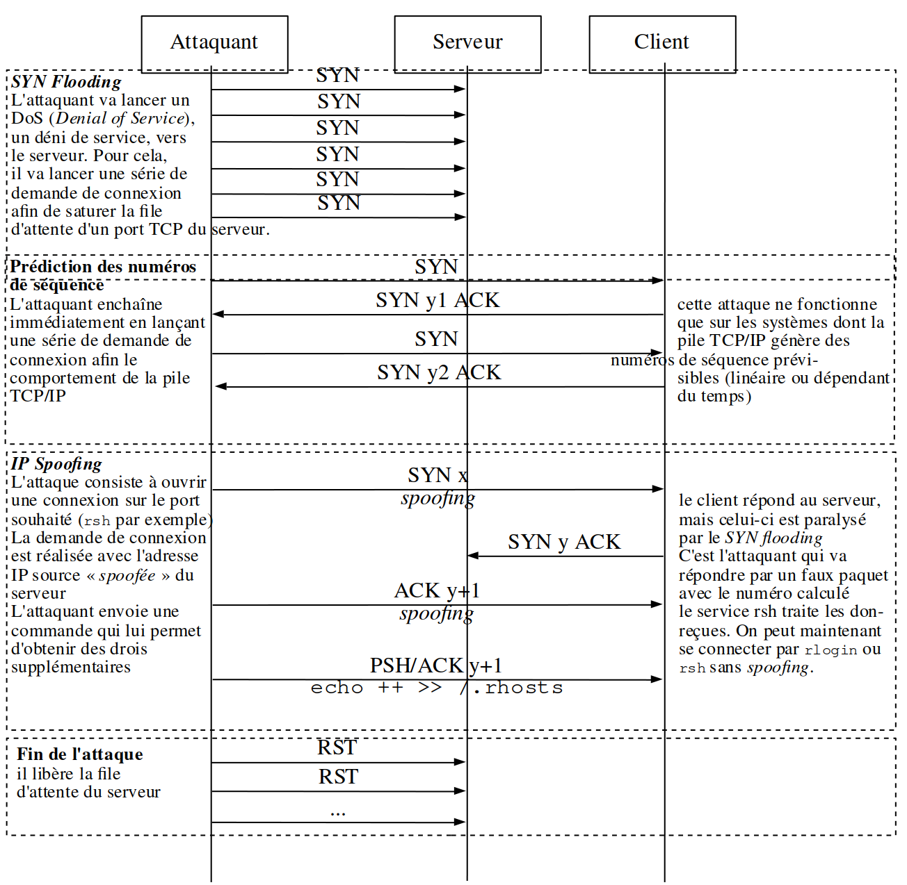

# L'attaque de Mitnick

L'[attaque de Mitnick](https://fr.wikipedia.org/wiki/Attaque_de_Mitnick) est le nom donné à l'attaque informatique faite par [Kevin Mitnick](https://fr.wikipedia.org/wiki/Kevin_Mitnick) le 25 décembre 1994 sur le réseau de l'expert en sécurité informatique Tsutomu Shimomura. Elle fait partie des cas d'intrusion les plus connus dans la sécurité informatique. Elle était connue en théorie dans le milieu universitaire depuis le milieu des années 1980, mais elle n'avait jamais encore été mise en pratique. Son côté inédit a donc fortement contribué à sa diffusion.

Elle utilisait deux techniques distinctes : l'[inondation de requêtes SYN](tcp-syn-flooding.md) et le [vol de session TCP](tcp-session-hijacking.md).

---
©️ LaSalle Avignon - [thierry(dot)vaira(at)gmail(dot)com](thierry.vaira@gmail.com)
