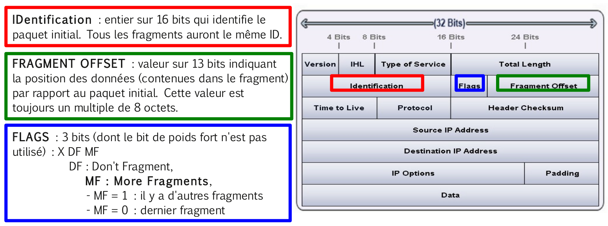

# Fragments attacks

Les attaques par fragments visent à passer les protections d'un pare-feu en utilisant les spécificités du protocole concernant la fragmentation des datagrammes [IP](../reseau/ip.md).

> Elles permettent aussi des [dénis de service](denial-of-service.md) en exploitant des faiblesses dans l'implémentation de certaines pile TCP/IP au niveau du réassemblage des fragments IP.

## La fragmentation IP

Lorsque la taille du paquet [IP](../reseau/ip.md) est plus grand que la valeur du MTU (_Maximum Transmission Unit_), la machine ou la passerelle (routeur) le fragmente en un certain nombre de fragments transportés par autant de trames sur le support physique.

> Le [MTU](https://fr.wikipedia.org/wiki/Maximum_transmission_unit) (_Maximum Transmission Unit_) est la taille maximale d'un paquet pouvant être transmis en une seule fois (sans fragmentation) sur une interface physique. Il correspond donc à la longueur en octets du champ _payload_ (DATA) de la trame (`Ethernet_II` par exemple) qui encapsule ce paquet.

Le destinataire final reconstitue le paquet initial à partir de l'ensemble des fragments reçus. On rappelle que les paquets peuvent emprunter des chemins différents pour atteindre une machine destinatrice.

> :exclamation: Si un seul des fragments est perdu, le paquet est considéré comme perdu.

Dans un paquet [IP](../reseau/ip.md), les champs utilisés pour la fragmentation sont :



En pratique, on peut paramétrer la valeur du MTU :

- Sous GNU/Linux :

```bash
# ifconfig eth0 mtu 100
# ip link set dev eth0 100
```

- sous Windows :

```bash
C:> netsh interface ipv4 set interface "Connexion au réseau local" mtu=100 store=persistent
```

Pour tester la fragmentation, il suffit d'utiliser la commande [ping](../../tldr/reseau/ping.md) avec l'option `-s` qui permet de déterminer la taille (_size_) des données à transmettre.

Exemple de manipulation avec un MTU de 1500 octets :

Le paquet est trop gros (`1473 + 20 + 8 = 1501` > MTU) et une fragmentation sera réalisée :

```bash
$ ping -­s 1473 www.google.fr
PING www.l.google.com (209.85.229.104) 1473(1501) bytes of data.
...
```

> Avec l'option `-M do`, on interdit la fragmentation.

Le paquet est trop gros (`1473 + 20 + 8 = 1501` > MTU) et une fragmentation serait nécessaire (ici le paquet n'est pas envoyé) :

```bash
$ ping -­M do -­s 1473 www.google.fr
PING www.l.google.com (209.85.229.104) 1473(1501) bytes of data.
From 192.168.52.2 icmp_seq=1 Frag needed and DF set (mtu = 1500)
```

Par contre avec un paquet égal au MTU (`1472 + 20 + 8 = 1500` == MTU) , il n' y aura pas de fragmentation :

```bash
$ ping -­M do -­s 1472 www.google.fr
PING www.l.google.com (209.85.229.104) 1472(1500) bytes of data.
64 bytes from ww­in­f104.google.com (209.85.229.104)
...
```

## L'attaque

L'attaque par fragments exploite le principe de filtrage du protocole [IP](../reseau/ip.md) par les pare-feux qui est d'appliquer la même règle à tous les fragments d'un paquet : le filtrage appliqué au premier fragment détermine cette règle et sera donc appliqué aux autres fragments sans vérification supplémentaire.

Il faut donc créer deux fragments dans lesquels la demande de connexion [TCP](../reseau/tcp.md) n'apparaisse que dans le deuxième fragment.

Il existe principalement deux méthodes :

- [Tiny Fragments](attaques-historiques/tiny-fragments.md)
- [Fragment Overlapping](attaques-historiques/fragment-overlapping.md)

---
©️ LaSalle Avignon - [thierry(dot)vaira(at)gmail(dot)com](thierry.vaira@gmail.com)
