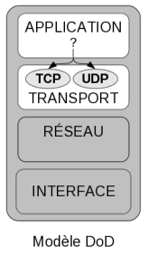
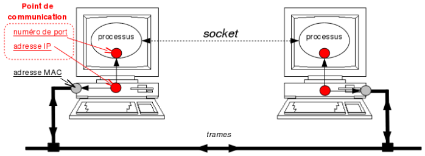
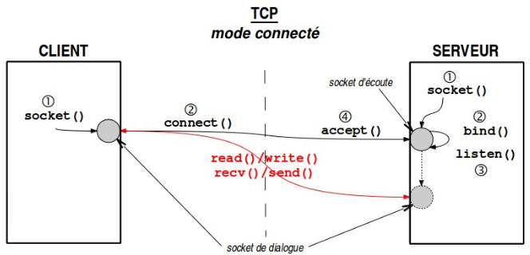
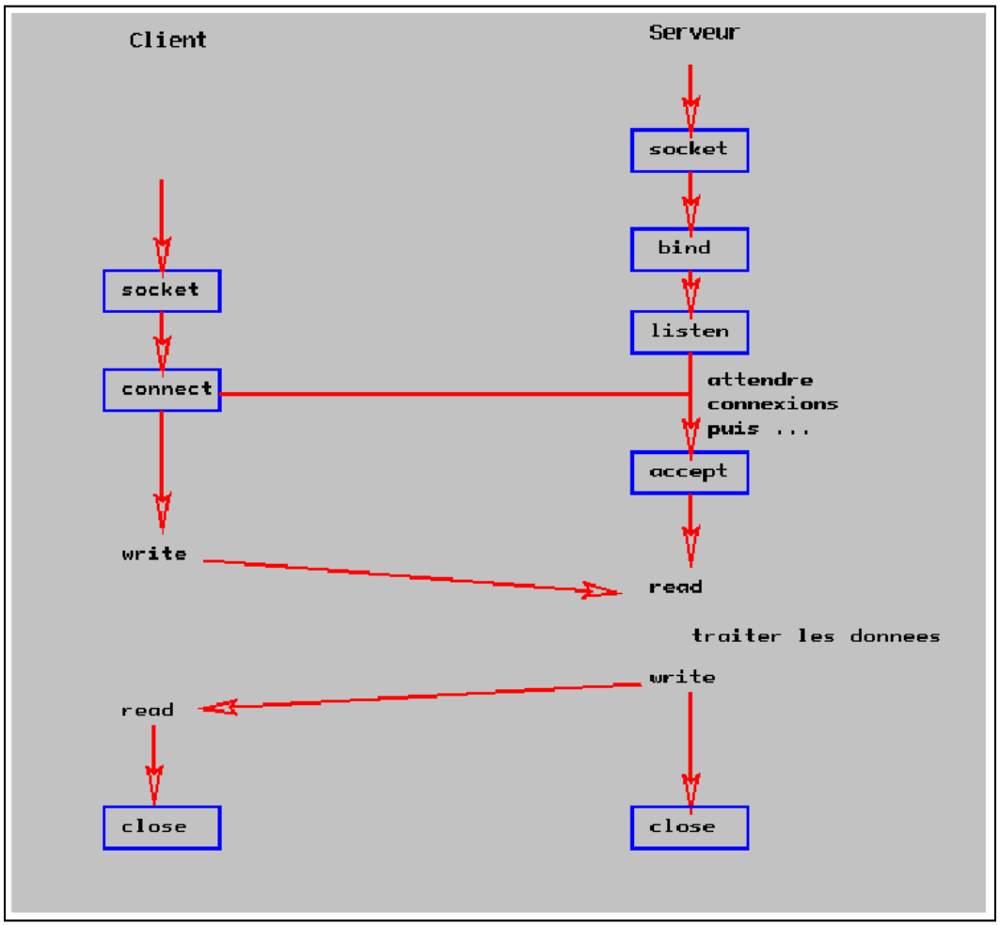
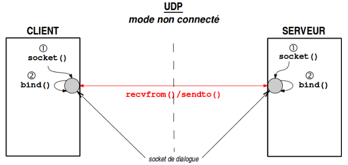
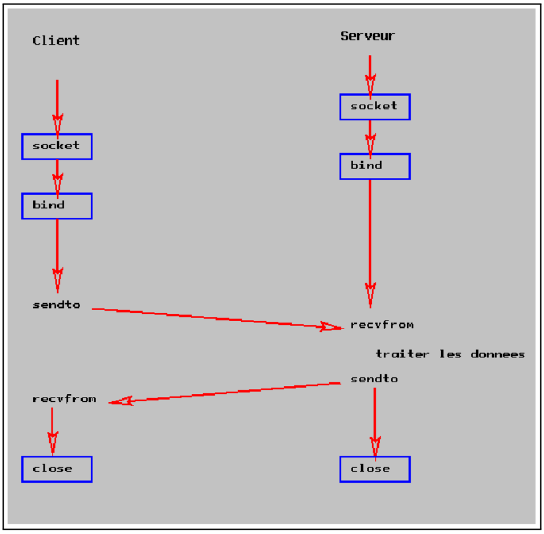

# Socket

Un(e) _socket_ représente une interface de communication logicielle avec le système d'exploitation qui permet d'exploiter les services d'un protocole réseau et par laquelle une application peut envoyer et recevoir des données.

C'est un **mécanisme de communication bidirectionelle entre processus** (locaux et/ou distants).

> La notion de _socket_ a été introduite dans les distributions de Berkeley (1982), c'est la raison pour laquelle on parle parfois de sockets BSD (_Berkeley Software Distribution_).

Un(e) _socket_ désigne aussi un ensemble normalisé de fonctions de communication (une API) qui est proposé dans quasiment tous les langages de programmation populaires (C, Java, C#, C++, ...) et répandue dans la plupart des systèmes d'exploitation (UNIX/Linux, Windows, ...).

Le développeur utilisera donc concrètement un(e) _socket_ pour programmer une application TCP/IP grâce à :

- l'API _Socket BSD_ sous Unix/Linux
- l'API _WinSocket_ sous Microsoft Windows

> Un(e) _socket_ est représentée comme un point d'entrée initial au niveau TRANSPORT du modèle à couches DoD dans la pile de protocole.

## Point de communication

Un(e) _socket_ est un point de communication par lequel un processus peut émettre et recevoir des données. Ce point de communication devra être relié à une **adresse IP** et un **numéro de port** dans le cas des protocoles Internet (TCP, UDP, ...).

Chaque processus devra créer un(e) socket de communication en indiquant :

- le **domaine** de communication : ceci sélectionne la famille de protocoles à employer (chaque famille possède son adressage) : domaine `AF_INET` pour Internet IPv4 et `AF_INET6` pour IPv6.
- le **type** de _socket_ à utiliser pour le dialogue : `SOCK_STREAM` (en mode connecté donc TCP par défaut), `SOCK_DGRAM` (en mode non connecté donc UDP) ou `SOCK_RAW` (un accès direct aux protocoles IP, ICMP, ...).
- le **numéro de protocole** à utiliser (cf `/etc/protocols`)

## Principe de communication

## Voir aussi

- [Programmation socket en C](http://tvaira.free.fr/bts-sn/reseaux/cours/cours-programmation-sockets.pdf)

- [netstat et ss](reseau/netstat.md) : affichage d'informations et statistiques réseau
- [netcat](reseau/netcat.md) : utilitaire permettant d'ouvrir des connexions réseau

---
©️ LaSalle Avignon - [thierry(dot)vaira(at)gmail(dot)com](thierry.vaira@gmail.com)
