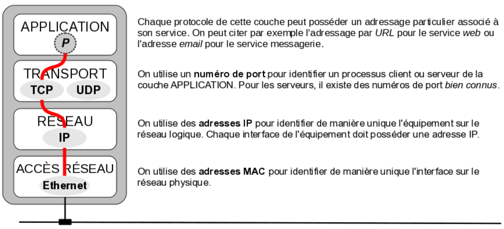
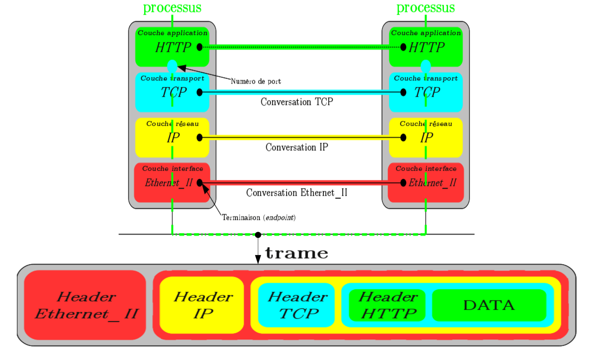

# L'adressage

Les adresses forment une notion importante en communication et sont un moyen d’identification.

Dans un réseau informatique, on distinguera :

## L’adressage physique

L’adressage physique utilise une adresse matérielle (appelée généralement [MAC](https://fr.wikipedia.org/wiki/Adresse_MAC)) qui permet d’identifier de manière unique l’interface de communication d’un équipement sur un réseau physique.

> Le concentrateur (_hub_) et le commutateur (_switch_) sont les équipements qui permettent de constituer un réseau physique.

Les [adresses MAC](https://fr.wikipedia.org/wiki/Adresse_MAC) :

- sont utilisées dans les entêtes des trames de la couche Liaison afin d’identifier l’émetteur et le destinataire.
- sont codées sur **48 bits soit 6 octets** (les trois 3 premiers octets permettent d’identifier le fabricant de l’interface de communication).
- ne donnent aucune indication sur la situation “géographique“ de l’équipement et donc ne permet pas une organisation optimale du réseau. Cette faiblesse sera compensée par un adressage logique au niveau de la couche Réseau.

Adresses particulières :

- `FF:FF:FF:FF:FF:FF` : Adresse de diffusion générale sur un réseau physique (_broadcast_)
- `01:00:5E:xx:xx:xx` :	Adresses _multicast_ IPv4
- etc.

> L'IEEE a défini un format similaire à 64 bits appelé EUI-64. Les adresses EUI-64 sont utilisées notamment par FireWire, IPv6, ZigBee, 802.15.4, 6LoWPAN, LoRaWAN.

Dans le cas d'IPv6, l'adresse EUI-64 est construite à partir de l'adresse MAC-48 en insérant `FFFE` dans les octets 4 et 5. L'adresse IPv6 utilise un format modifié dans lequel le bit U/L est inversé.

## L’adressage logique

L’adressage logique intervient au niveau de la couche Réseau afin d’identifier un équipement dans un réseau.

> Le routeur est le seul équipement permettant de faire communiquer des réseaux logiques entre eux.

L’adressage logique le plus utilisé actuellement est l’adressage [IP](ip.md).

Les adresses IP :

- sont utilisées dans les entêtes des paquets afin d’identifier l’émetteur et le destinataire.
- sont codées sur **32 bits (pour la version 4) et sur 128 bits (pour la version 6)**.
- utilisent une **notation décimale pointée** pour la version 4 qui est encore la plus utilisée actuellement : quatre nombres, compris entre `0` et `255`, séparés par des points `.` (exemple : `212.85.150.134`).
- sont décomposables en deux parties en utilisant un masque :
  - le _netid_ qui identifie le réseau auquel appartient l’hôte
  - le _hostid_ qui identifie le numéro de l’hôte dans ce réseau.

Pour décomposer une adresse IP (c’est-à-dire séparer le _netid_ du _hostid_), il faut utiliser un **masque** (_netmask_). Chaque équipement effectuera une opération **ET** (bit à bit) entre l’adresse IP complète et le masque.

Il suffit alors de placer des bits à `1` dans le masque pour conserver le _netid_ et des `0` pour écraser le _hostid_. Un masque a donc la même longueur qu’une adresse IP.

C’est donc la valeur du masque qui définit le _netid_ (et donc le _hostid_). On parle de masque de réseau ou de sous-réseau (_subnet_).

Pour exprimer le masque, on peut utiliser deux notations :

- la notation **décimale pointée**, exemple : `255.255.255.0`
- la notation **CIDR** où on indique le nombre de bits de poids fort (donc à `1`), exemple : `/24`

On distingue différents techniques d’adressage :

- l’_unicast_ désigne une adresse réseau unique permettant d’identifier un hôte sur un réseau. L’adresse _unicast_ est la seule adresse utilisable comme adresse source dans un paquet.
- le _broadcast_ permet le transfert d’un hôte vers tous les autres hôtes, en utilisant une adresse spécifique nommée adresse de _broadcast_ (ou adresse de diffusion générale).
- le _multicast_ permet la communication simultanée avec un groupe d'équipements identifiés par une adresse spécifique nommée adresse
de _multicast_ (ou adresse de groupe). Les récepteurs intéressés par les messages adressés en _multicast_ peuvent s’abonner au préalable à ce groupe.
- l’_anycast_ désigne une technique où on l’on dispose de plusieurs adresses pour une destination mais une seule sera utilisée (au plus proche).

## L’adressage des protocoles

Une communication réseau s'appuie sur le principe de l'encapsulation des protocoles. 

> On fait souvent référence à un modèle pour représenter cette communication. Le modèle le plus utilisé est celui qui implémente les protocoles de la famille « TCP/IP » appelée aussi [DoD](https://www.frameip.com/tcpip/) (_Department of Defense_).

En sachant qu'une couche se décomposera en deux parties comprenant un en­tête (_header_) appelé aussi PCI (_Protocol Control Information_) dans le modèle [OSI](https://www.frameip.com/osi/) et un champ _payload_ ou DATA (au sens « _network data_ ») ou PDU (_Protocol Data Unit_) dans le modèle [OSI](https://www.frameip.com/osi/). En fait, cela représente les protocoles présents dans la trame de la manière suivante :

On comprend alors que le champ DATA d'une couche contient le bloc de la couche supérieure (Header + DATA) et ainsi de suite. C'est le principe de l'**encapsulation** des protocoles.

> Certaines couches ou certains champs DATA peuvent être vides. Par exemple, une demande de connexion TCP vers un site web n'encapsule que les protocoles Ethernet_II, IP et TCP car la couche application est pour l'instant vide.

Il y a deux aspects à prendre en compte dans un échange :

- le transfert physique de trames contenant des protocoles encapsulés (fabrication à l'émission et décodage à la réception : parcours vertical du modèle). Sur un réseau physique, la trame est la seule composante concrètement échangée par des noeuds.
- un dialogue logique entre protocole de couche spécifique (dialogue virtuel horizontal entre deux modèles). C'est un même protocole qui permet à deux entités de "se comprendre".

Comme il peut exister plusieurs protocoles par couche, un protocole utilise des numéros (les _assigned numbers_) identifiant les protocoles de niveau supérieur qu’il transporte.

> La trame Ethernet_II possède un champ `Type` (`/etc/ethertypes`) qui indique le type de paquet transporté. Un paquet IP possède un champ `Protocol` (`/etc/protocols`) qui indique le protocole de couche supérieure. Un segement TCP ou un datagramme UDP possède un champ `Port Destination` (`/etc/services`) qui indique le protocole de couche Application. Ces différentes valeurs ont été renseignées lors de l'émission et permettent de "remonter" le modèle à couches à la reception.

## L’adressage des ressources

De manière générale, l’adressage des ressources est spécifique au protocole de la couche Application utilisé.

L'[URI](https://fr.wikipedia.org/wiki/Uniform_Resource_Identifier) (_Uniform Resource Identifier_) est une chaîne de caractères identifiant une ressource sur un réseau.

Exemples :

- boîte aux lettres électronique : `mailto:john.doe@mail.com` ;
- [FTP](ftp.md) : `ftp://ftp.mozilla.org/pub/mozilla.org/firefox/releases/` ;

Les [URL](https://fr.wikipedia.org/wiki/Uniform_Resource_Locator) (_Uniform Resource Locator_) constituent un sous-ensemble des [URI](https://fr.wikipedia.org/wiki/Uniform_Resource_Identifier).

Une [URL](https://fr.wikipedia.org/wiki/Uniform_Resource_Locator) (_Uniform Resource Locator_) ou adresse web est une chaîne de caractères uniforme qui permet d'identifier une ressource du _World Wide Web_ par son emplacement et de préciser le protocole internet pour la récupérer (par exemple `http` ou `https`), par exemple : `https://github.com/btssn-lasalle84/`.

## Voir aussi

- [Interface de communication](interface.md)

---
©️ LaSalle Avignon - [thierry(dot)vaira(at)gmail(dot)com](thierry.vaira@gmail.com)
