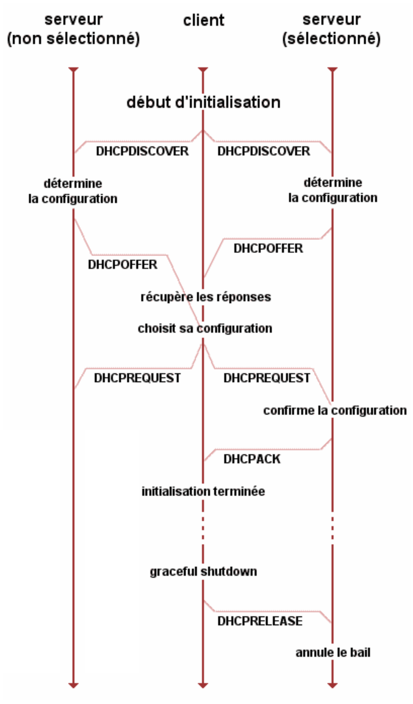
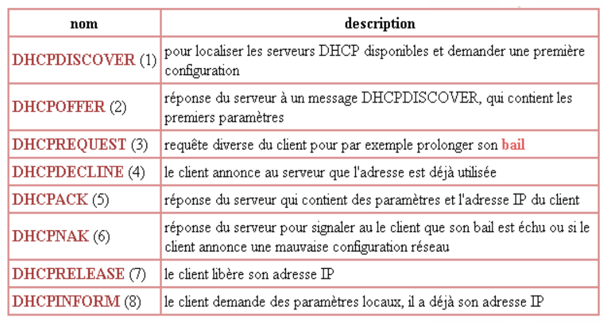

# DHCP (Dynamic Host Configuration Protocol)

[DHCP](https://fr.wikipedia.org/wiki/Dynamic_Host_Configuration_Protocol) désigne un protocole réseau (RFC [1541](https://tools.ietf.org/html/rfc1531) et [2131](https://tools.ietf.org/html/rfc2131) essentiellement) dont le rôle est d'assurer la configuration automatique des paramètres IP d'une station, notamment en lui assignant automatiquement une adresse IP et un masque de sous­réseau pour une durée limitée (**bail**, _lease_ en anglais).

## Principe

DHCP fonctionne sur le modèle client-serveur : un serveur, qui détient la politique d'attribution des configurations IP, envoie une configuration donnée pour une durée donnée à un client donné (typiquement, une machine qui vient de démarrer). Le serveur va servir de base pour toutes les requêtes DHCP (il les reçoit et y répond), aussi doit-il avoir une configuration IP fixe. Le protocole DHCP s'appuie entièrement sur BOOTP en reprenant le mécanisme de base et le format des messages. DHCP est une extension de BOOTP.

> Dans un réseau IP, on peut donc n'avoir qu'une seule machine avec adresse IP fixe : le serveur DHCP.

```bash
$ cat /etc/services | grep -i "bootp" | grep -i "udp"
bootps
67/udp
bootpc
68/udp
```

- Numéro de port serveur : `67`
- Numéro de port client  : `68`



## Messages DHCP



Pour capturer les trames, on utilise l'outil `tcpdump` ou [wireshark](../../outils/wireshark.md) (en filtrant sur les numéros de port), ici côté serveur :

```bash
$ sudo tcpdump -tne -v -i enp0s3 port 67 or port 68
tcpdump: listening on enp0s3, link-type EN10MB (Ethernet), capture size 262144 bytes
00:01:6c:d1:25:3b > ff:ff:ff:ff:ff:ff, ethertype IPv4 (0x0800), length 342: (tos 0x10, ttl 128, id 0, offset 0, flags [none], proto UDP (17), length 328)
    0.0.0.0.68 > 255.255.255.255.67: BOOTP/DHCP, Request from 00:01:6c:d1:25:3b, length 300, xid 0xba5f34a, Flags [none]
	  Client-Ethernet-Address 00:01:6c:d1:25:3b
	  Vendor-rfc1048 Extensions
	    Magic Cookie 0x63825363
	    DHCP-Message Option 53, length 1: Discover
	    Hostname Option 12, length 6: "bts-sn"
	    Parameter-Request Option 55, length 13:
	      Subnet-Mask, BR, Time-Zone, Default-Gateway
	      Domain-Name, Domain-Name-Server, Option 119, Hostname
	      Netbios-Name-Server, Netbios-Scope, MTU, Classless-Static-Route
	      NTP
...
```

## Options

Lorsque le serveur DHCP renvoie l’accusé de réception (`DHCP ACK`) qui assigne au client l’adresse IP et son masque de sous-réseau, la durée du bail de cette adresse , il peut éventuellement fournir d'autres paramètres comme par exemple :

- adresse IP de la passerelle par défaut,
- adresses IP des serveurs DNS,
- adresses IP des serveurs NBNS (WINS).

## Durée du bail

Les adresses IP dynamiques sont octroyées pour une durée limitée (durée du bail, ou _lease time_).

La valeur T1 (par défaut, 50 % de la durée du bail) détermine la durée après laquelle le client commence à demander périodiquement le renouvellement de son bail auprès du serveur qui lui a accordé son adresse. Cette fois, la transaction est effectuée par transmission IP classique, d’adresse à adresse.

Si, lorsque le délai fixé par la deuxième valeur, T2 (par défaut, 87,5 % de la durée du bail), est écoulé et que le bail n’a pas pu être renouvelé, le client demande une nouvelle allocation d’adresse par diffusion.

## Exemple de configuration sous Linux

L'Internet Software Consortium développe un serveur DHCP pour le monde du logiciel libre. C'est le serveur DHCP le plus répandu et celui qui respecte au mieux les RFCs. L'une des principales innovations de la version 3 est la possibilité de mettre à jour un DNS dynamiquement en fonction des adresses IP fournies par le serveur DHCP.

> Microsoft a bien entendu son propre serveur DHCP pour Windows.

Le fichier `dhcpd.conf` contient la configuration du serveur. Par défaut, il se trouve dans le répertoire `/etc`. Il est composé de plusieurs sections, chacune limitée par des accolades `{` et `}`.

```
subnet 192.168.52.0 netmask 255.255.255.0
{
    default-lease-time 28800;
    max-lease-time 86400;
    range 192.168.52.90 192.168.52.248;
    option routers 192.168.52.42;
    option domain-name-servers 80.10.246.3, 192.168.52.83;
}
```

Démarrer le service :

```bash
# service dhcpd start
```

La liste des adresses attribuées par le serveur se trouve ici :

```bash
# cat /var/lib/dhcp/dhcpd.leases
```

> DHCP fonctionne avec IPv4 mais il fonctionne aussi avec IPv6 et il est alors appelé DHCPv6. Toutefois, en IPv6, les adresses peuvent être autoconfigurées sans DHCP.

## Vulnérabilités

Lire : [DHCP Snooping](https://www.ionos.fr/digitalguide/serveur/securite/dhcp-snooping/)

## Dnsmasq

Dnsmasq est un serveur léger pour fournir les services DNS, **DHCP**, BOOTP et TFTP pour un petit réseau, voire pour un poste de travail. Il permet d’offrir un service de nommage des machines d’un réseau local privé non intégrées au service
DNS d’Internet.

Documentations :

- http://www.thekelleys.org.uk/dnsmasq/doc.html
- pour les options de configuration http://www.thekelleys.org.uk/dnsmasq/docs/dnsmasq-man.html#lbAF et,
- aussi https://doc.ubuntu-fr.org/configuration_serveur_dns_dhcp

```bash
$ sudo apt-get install dnsmasq

$ systemctl status dnsmasq
 dnsmasq.service - dnsmasq - A lightweight DHCP and caching DNS server
   Loaded: loaded (/lib/systemd/system/dnsmasq.service; enabled; vendor preset: enabled)
   Active: active (running) since Sun 2020-02-02 08:47:58 UTC; 1min 22s ago
 Main PID: 1830 (dnsmasq)
    Tasks: 1 (limit: 1108)
   CGroup: /system.slice/dnsmasq.service
           |-1830 /usr/sbin/dnsmasq -x /run/dnsmasq/dnsmasq.pid -u dnsmasq -7 /etc/dnsmasq.d,.dpkg-dist,.dpkg-old,.dpkg-new --local-service --trust-anchor=.,19036,8,2,49aac1

févr. 02 08:47:58 serveur systemd[1]: Starting dnsmasq - A lightweight DHCP and caching DNS server...
févr. 02 08:47:58 serveur dnsmasq[1808]: dnsmasq: syntax check OK.
févr. 02 08:47:58 serveur dnsmasq[1830]: started, version 2.79 cachesize 150
févr. 02 08:47:58 serveur dnsmasq[1830]: compile time options: IPv6 GNU-getopt DBus i18n IDN DHCP DHCPv6 no-Lua TFTP conntrack ipset auth DNSSEC loop-detect inotify
févr. 02 08:47:58 serveur dnsmasq[1830]: reading /etc/resolv.conf
févr. 02 08:47:58 serveur dnsmasq[1830]: using nameserver 127.0.0.53#53
févr. 02 08:47:58 serveur dnsmasq[1830]: read /etc/hosts - 10 addresses
févr. 02 08:47:58 serveur systemd[1]: Started dnsmasq - A lightweight DHCP and caching DNS server.

$ dnsmasq -v
Dnsmasq version 2.79  Copyright (c) 2000-2018 Simon Kelley

$ journalctl -f -xe --unit=dnsmasq
...
janv. 20 13:51:17 bts-sn dnsmasq-dhcp[3508]: DHCPDISCOVER(enp0s3) 00:01:6c:d1:25:3b
janv. 20 13:51:17 bts-sn dnsmasq-dhcp[3508]: DHCPOFFER(enp0s3) 192.168.52.48 00:01:6c:d1:25:3b
janv. 20 13:51:17 bts-sn dnsmasq-dhcp[3508]: DHCPREQUEST(enp0s3) 192.168.52.48 00:01:6c:d1:25:3b
janv. 20 13:51:17 bts-sn dnsmasq-dhcp[3508]: DHCPACK(enp0s3) 192.168.52.48 00:01:6c:d1:25:3b bts-sn
```

La configuration de dnsmasq est réalisée dans le fichier `/etc/dnsmasq.conf`.

Exemple :

```bash
$ cat /etc/dnsmasq.conf | grep -vE "^[# ]"
log-dhcp
#dhcp-authoritative
dhcp-range=192.168.52.100,192.168.52.150,12h
dhcp-host=2c:fd:a1:bb:bc:0f,192.168.52.151
dhcp-option=option:netmask,255.255.255.0
dhcp-option=option:router,192.168.52.1
dhcp-option=option:dns-server,192.168.52.60
dhcp-leasefile=/var/lib/misc/dnsmasq.leases
```

> Il existe aussi les options `dhcp-option=option:ntp-server,X.X.X.X` ... Il est possible d'ajouter l'option `dhcp-authoritative` si dnsmasq est définitivement le seul serveur DHCP sur le réseau. L'option `log-dhcp` permet d'activer la journalisation qui se situera dans `/var/log/syslog`.

Test côté client :

```bash
$ sudo cat /etc/dhcp/dhclient.conf | grep -vE "^[# ]"

option rfc3442-classless-static-routes code 121 = array of unsigned integer 8;

send host-name = gethostname();
request subnet-mask, broadcast-address, time-offset, routers,
	domain-name, domain-name-servers, domain-search, host-name,
	dhcp6.name-servers, dhcp6.domain-search, dhcp6.fqdn, dhcp6.sntp-servers,
	netbios-name-servers, netbios-scope, interface-mtu,
	rfc3442-classless-static-routes, ntp-servers;

timeout 300;

# pour les tests :
reject 192.168.52.85;
reject 192.168.52.42;
```bash

> Il est possible que d'autres serveurs DHCP soient présents sur le réseau et répondent aux requêtes du client. Il est possible de les ignorer en les indiquant dans le fichier `/etc/dhcp/dhclient.conf` avec l'option `reject`.


```bash
$ ifconfig
enp2s0: flags=4163<UP,BROADCAST,RUNNING,MULTICAST>  mtu 1500
...

$ sudo dhclient -v enp2s0
Internet Systems Consortium DHCP Client 4.4.1
Copyright 2004-2018 Internet Systems Consortium.
All rights reserved.
For info, please visit https://www.isc.org/software/dhcp/

Listening on LPF/enp2s0/00:01:6c:d1:25:3b
Sending on   LPF/enp2s0/00:01:6c:d1:25:3b
Sending on   Socket/fallback
DHCPDISCOVER on enp2s0 to 255.255.255.255 port 67 interval 3 (xid=0x2318cb15)
DHCPOFFER from 192.168.52.85 rejected by rule 192.168.52.85 mask 255.255.255.255.
DHCPOFFER of 192.168.52.48 from 192.168.52.204
DHCPREQUEST for 192.168.52.48 on enp2s0 to 255.255.255.255 port 67 (xid=0x15cb1823)
DHCPNACK from 192.168.52.85 rejected by rule 192.168.52.85 mask 255.255.255.255.
DHCPACK of 192.168.52.48 from 192.168.52.204 (xid=0x2318cb15)
bound to 192.168.52.48 -- renewal in 16596 seconds.

// ou (cf. dhcp-authoritative) :
$ sudo dhclient -v -s 192.168.52.204 enp2s0
```

L'allocation de l'adresse est consignée dans le fichier `dhclient.leases` :

```bash
$ cat /var/lib/dhcp/dhclient.leases
lease {
  interface "enp2s0";
  fixed-address 192.168.52.48;
  option subnet-mask 255.255.255.0;
  option routers 192.168.52.42;
  option dhcp-lease-time 86400;
  option dhcp-message-type 5;
  option domain-name-servers 8.8.8.8;
  option dhcp-server-identifier 192.168.52.42;
  renew 3 2021/01/20 21:32:52;
  rebind 4 2021/01/21 09:11:25;
  expire 4 2021/01/21 12:11:25;
}
```

## isc-dhcp-server

L'_Internet Software Consortium_ développe un serveur DHCP pour le monde du logiciel libre. C'est le serveur DHCP le plus répandu et celui qui respecte au mieux les RFCs. L'une des principales innovations de la version 3 est la possibilité de mettre à jour un DNS dynamiquement en fonction des adresses IP fournies par le serveur DHCP.

Il est distribué par le paquet `isc-dhcp-server`.

```bash
$ sudo apt-get install isc-dhcp-server

$ systemctl [enable|diable|start|stop|restart|relaod|status] isc-dhcp-server
```

Le fichier `/etc/dhcp/dhcpd.conf` contient la configuration du serveur. Il est composé de plusieurs sections, chacune limitée par des accolades.

Documentation : https://doc.ubuntu-fr.org/isc-dhcp-server

## En résumé

DHCP (_Dynamic Host Configuration Protocol_) permet d'automatiser la configuration TCP/IP des machines du réseau, quel que soit leur système d'exploitation.

L'utilisation de DHCP simplifie l'administration système en regroupant en un seul point la configuration de tout un réseau (adresses dynamiques, semi-statiques, masque de sous-réseaux, DNS, passerelle par défaut, ...).

Le service DHCP peut aussi servir à renvoyer la configuration des démarrages par réseau (serveur de _boot_, fichiers de démarrage réseau, ...).

Il est nécessaire de configurer le serveur DHCP avec une adresse IP statique.

---
©️ LaSalle Avignon - [thierry(dot)vaira(at)gmail(dot)com](thierry.vaira@gmail.com)
