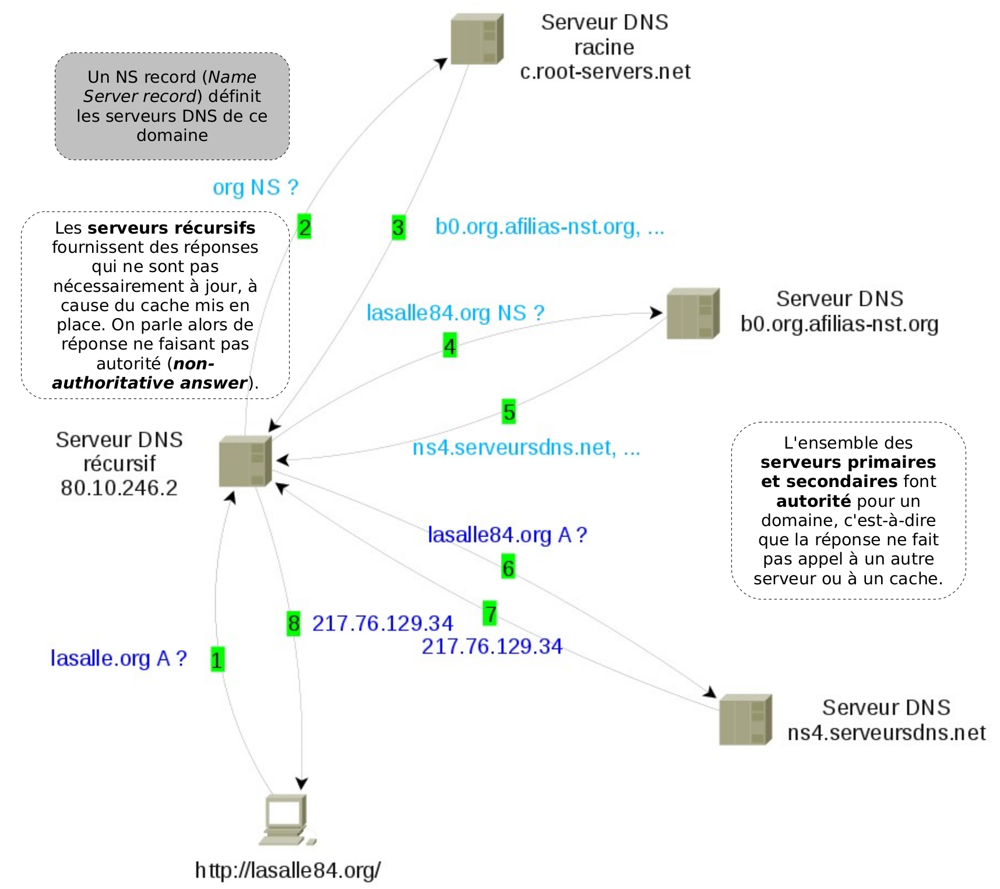

# DNS (_Domain Name System_)

Le [DNS](https://fr.wikipedia.org/wiki/Domain_Name_System) (système de noms de domaine) est un service permettant de traduire un nom de domaine en adresses IP de la machine portant ce nom (RFC [882](https://tools.ietf.org/html/rfc882)/[883](https://tools.ietf.org/html/rfc883) en 1983).

DNS utilise le protocole de transport [UDP](udp.md) et le port `53`. La taille maximale des paquets utilisée est de 512 octets.

Le type d'enregistrement de ressource RR (Resource Record) est codé sur 16 bits.

Les principaux enregistrements définis sont les suivants :

- `A record` (_Address record_) qui fait correspondre un nom d'hôte à une adresse IPv4 de 32 bits distribués sur quatre octets. `AAAA` pour IPv6.

- `CNAME record` (_Canonical Name record_) qui permet de faire d'un domaine un alias vers un autre. Cet alias hérite de tous les sous-domaines de l'original.

- `PTR record` (_PoinTer Record_) qui associe une adresse IP à un enregistrement de nom de domaine (aussi dit « _reverse_ » car il fait le contraire du `A record`).

## Hiérarchie du DNS

Le système des noms de domaines consiste en une hiérarchie dont le sommet est appelé la **racine** (représentée par un point `.`). Dans un domaine, on peut créer un ou plusieurs sous-domaines ainsi qu'une délégation pour ceux-ci (les informations relatives à ce sous-domaine sont enregistrées sur un autre serveur).

Les domaines se trouvant immédiatement sous la racine sont appelés domaine de premier niveau (TLD : _Top Level Domain_). Les noms de domaines ne correspondant pas à une extension de pays sont appelés des domaines génériques (gTLD), par exemple `.org` ou `.com`. S'ils correspondent à des codes de pays (fr, be, ch...), on les appelle ccTLD (_country code_ TLD).

> On représente un nom de domaine en indiquant les domaines successifs séparés par un point `.` , les noms de domaines supérieurs se trouvant à droite.

## FQDN (_Fully qualified domain name_)

On entend par **FQDN** (ou **nom de domaine pleinement qualifié**) un nom de domaine écrit de façon absolue, y compris tous
les domaines jusqu'au domaine de premier niveau (TLD), il est ponctué par un point final. Dans une réseau TCP/IP, une adresse FQDN sera l'association entre le nom de la machine et le domaine auquel elle appartient.

> La norme prévoit qu'un élément d'un nom de domaine (appelé label) ne peut dépasser 63 caractères, un FQDN ne pouvant dépasser 255 caractères.

## Principe

Les hôtes n'ont qu'une connaissance limitée du système des noms de domaine. Quand ils doivent résoudre un nom, ils s'adressent à un ou plusieurs serveurs de noms dits **récursifs**, c'est-à-dire qui vont parcourir la hiérarchie DNS et faire suivre la requête à un ou plusieurs autres serveurs de noms pour fournir une réponse.

Quand un serveur DNS récursif doit trouver l'adresse IP de `www.lasalle84.org`, un **processus itératif** démarre pour consulter la hiérarchie DNS. Ce serveur demande aux serveurs DNS appelés **serveur racine** quels serveurs peuvent lui répondre pour la zone `org`.

Parmi ceux-ci, notre serveur va en choisir un pour savoir quels serveurs sont capables de lui répondre pour la zone `lasalle84.org`. C'est un de ces derniers qui pourra lui donner l'adresse IP de `www.lasalle84.org`. S'il se trouve qu'un serveur ne répond pas, un autre serveur de la liste sera consulté.



## Serveurs racines

Les [serveurs “racine”](https://fr.wikipedia.org/wiki/Serveur_racine_du_DNS) sont gérés par douze organisations différentes (2 européennes, 1 japonaise et 9 américaines). Sept de ces serveurs sont en réalité distribués dans le monde grâce à la technique [anycast](https://fr.wikipedia.org/wiki/Anycast) (plus de 200 serveurs répartis dans 50 pays du monde) et neuf disposent d'une adresse IPv6. Il existe 13 autorités de nom appelées de `a` à `m.root-servers.net`. Le serveur `k` reçoit par exemple de l'ordre de 20 000 requêtes par seconde.


## Vulnérabilités

Lire : [Sécurité des serveurs racine](https://fr.wikipedia.org/wiki/Serveur_racine_du_DNS#S%C3%A9curit%C3%A9_des_serveurs_racine)

## Dnsmasq

Dnsmasq est un serveur léger pour fournir les services DNS, **DHCP**, BOOTP et TFTP pour un petit réseau, voire pour un poste de travail. Il permet d’offrir un service de nommage des machines d’un réseau local privé non intégrées au service
DNS d’Internet.

Documentations :

- http://www.thekelleys.org.uk/dnsmasq/doc.html
- pour les options de configuration http://www.thekelleys.org.uk/dnsmasq/docs/dnsmasq-man.html#lbAF et,
- aussi https://doc.ubuntu-fr.org/configuration_serveur_dns_dhcp

```bash
$ sudo apt-get install dnsmasq

$ systemctl status dnsmasq
 dnsmasq.service - dnsmasq - A lightweight DHCP and caching DNS server
   Loaded: loaded (/lib/systemd/system/dnsmasq.service; enabled; vendor preset: enabled)
   Active: active (running) since Sun 2020-02-02 08:47:58 UTC; 1min 22s ago
 Main PID: 1830 (dnsmasq)
    Tasks: 1 (limit: 1108)
   CGroup: /system.slice/dnsmasq.service
           |-1830 /usr/sbin/dnsmasq -x /run/dnsmasq/dnsmasq.pid -u dnsmasq -7 /etc/dnsmasq.d,.dpkg-dist,.dpkg-old,.dpkg-new --local-service --trust-anchor=.,19036,8,2,49aac1

févr. 02 08:47:58 serveur systemd[1]: Starting dnsmasq - A lightweight DHCP and caching DNS server...
févr. 02 08:47:58 serveur dnsmasq[1808]: dnsmasq: syntax check OK.
févr. 02 08:47:58 serveur dnsmasq[1830]: started, version 2.79 cachesize 150
févr. 02 08:47:58 serveur dnsmasq[1830]: compile time options: IPv6 GNU-getopt DBus i18n IDN DHCP DHCPv6 no-Lua TFTP conntrack ipset auth DNSSEC loop-detect inotify
févr. 02 08:47:58 serveur dnsmasq[1830]: reading /etc/resolv.conf
févr. 02 08:47:58 serveur dnsmasq[1830]: using nameserver 127.0.0.53#53
févr. 02 08:47:58 serveur dnsmasq[1830]: read /etc/hosts - 10 addresses
févr. 02 08:47:58 serveur systemd[1]: Started dnsmasq - A lightweight DHCP and caching DNS server.

$ dnsmasq -v
Dnsmasq version 2.79  Copyright (c) 2000-2018 Simon Kelley

$ journalctl -f -xe --unit=dnsmasq
...
janv. 20 13:51:17 bts-sn dnsmasq-dhcp[3508]: DHCPDISCOVER(enp0s3) 00:01:6c:d1:25:3b
janv. 20 13:51:17 bts-sn dnsmasq-dhcp[3508]: DHCPOFFER(enp0s3) 192.168.52.48 00:01:6c:d1:25:3b
janv. 20 13:51:17 bts-sn dnsmasq-dhcp[3508]: DHCPREQUEST(enp0s3) 192.168.52.48 00:01:6c:d1:25:3b
janv. 20 13:51:17 bts-sn dnsmasq-dhcp[3508]: DHCPACK(enp0s3) 192.168.52.48 00:01:6c:d1:25:3b bts-sn
```

La configuration de dnsmasq est réalisée dans le fichier `/etc/dnsmasq.conf`.

Exemple :

```bash
$ cat /etc/dnsmasq.conf | grep -vE "^[# ]"
$ cat /etc/dnsmasq.conf | grep -vE "^[# ]"
port=53
domain-needed
bogus-priv
local=/bts-sn.lan/
domain=bts-sn.lan
strict-order
expand-hosts
```

Avec :

```bash
$ cat /etc/hosts
127.0.0.1 localhost
127.0.1.1 serveur

192.168.52.60 www.bts-sn.lan
192.168.52.60 serveur.bts-sn.lan
192.168.52.61 client1.bts-sn.lan

192.168.52.85 bigbrother.bts-sn.lan
...

$ cat /etc/resolv.conf
nameserver 127.0.0.1
nameserver 8.8.8.8
```

Test :

```bash
$ host client1.bts-sn.lan
client1.bts-sn.lan has address 192.168.52.61
...
```

## BIND (named)

Le serveur de nom fourni avec Ubuntu Linux est BIND (_Berkeley Internet Name Domain_). BIND est composé, entre autre, du démon `/usr/sbin/named` et de la commande `/usr/sbin/rndc`.

Il suffit d'installer le paquet `bind9` :

```bash
$ sudo apt-get install bind9 dnsutils
```

> Le paquet `dnsutils` fournit des outils très pratiques pour tester le service DNS.

Les fichiers de configuration de `bind9` sont stockés dans `/etc/bind/`.

Il lit sa configuration dans le fichier `/etc/bind/named.conf`, et stocke ses informations dans le répertoire `/var/cache/bind/`.

```
zone "xxx.esimed" {
    type master;
    file "/etc/bind/db.esimed.xxx";
};

zone "0.168.192.in-addr-arpa" {
    type master;
    file "/etc/bind/db.esimed.xxx.rev";
};
```

> Les fichiers de zones contiennent les enregistrements constituant les différents noms de machines et serveurs du domaine.

Les différents types d'enregistrements les plus courants sont:
- `A` : _Address_, un nom de machine associé à une adresse IP.
- `CNAME : _Canonical NAME_, un alias sur un nom de machine.
- `MX` : _Mail eXchange_, noms des serveurs de mails du domaine.
- `NS` : _Name Server_, noms des serveurs DNS.
- `SOA` : _Start Of Authority_, informations à propos de cette zone.
- et pour la résolution inverse `PTR` : _PoinTeR_, une adresse IP associée à un nom de machine.

```
$TTL 86400
@   IN  SOA ns.xxx.lasalle. root.xxx.lasalle. (
            12345 ; Version
            21600 ; Refresh secondaires
            3600 ; Attente après demande erronee
            604800 ; TTL max dans les caches des DNS secondaires
            86400 ; TTL min dans les caches
        )
    IN  NS  ns.xxx.lasalle.
    IN  MX  10 mail.xxx.lasalle.

@   IN  A   192.168.0.2
ns  IN  A   192.168.0.2
mail    IN  A   192.168.0.2
server  IN  A   192.168.0.2
client  IN  A   192.168.0.3
www   IN CNAME server
```

Documentation : https://doc.ubuntu-fr.org/bind9

## Capture

Pour capturer les trames, on utilise l'outil `tcpdump` ou [wireshark](../../outils/wireshark.md) (en filtrant sur les numéros de port), ici côté serveur :

```bash
$ cat /etc/services | grep -i "domain"
domain		53/tcp				# Domain Name Server
domain		53/udp

$ sudo tcpdump -tne -v -i enp0s3 port 53
tcpdump: listening on enp0s3, link-type EN10MB (Ethernet), capture size 262144 bytes
2c:fd:a1:bb:bc:0f > 08:00:27:f8:2b:7b, ethertype IPv4 (0x0800), length 78: (tos 0x0, ttl 64, id 33742, offset 0, flags [DF], proto UDP (17), length 64)
    192.168.52.12.36994 > 192.168.52.60.53: 244+ A? serveur.bts-sn.lan. (36)
08:00:27:f8:2b:7b > 2c:fd:a1:bb:bc:0f, ethertype IPv4 (0x0800), length 110: (tos 0x0, ttl 64, id 16356, offset 0, flags [DF], proto UDP (17), length 96)
    192.168.52.60.53 > 192.168.52.12.36994: 244* 2/0/0 serveur.bts-sn.lan. A 127.0.1.1, serveur.bts-sn.lan. A 192.168.52.60 (68)
2c:fd:a1:bb:bc:0f > 08:00:27:f8:2b:7b, ethertype IPv4 (0x0800), length 78: (tos 0x0, ttl 64, id 33743, offset 0, flags [DF], proto UDP (17), length 64)
    192.168.52.12.42661 > 192.168.52.60.53: 41522+ AAAA? serveur.bts-sn.lan. (36)
08:00:27:f8:2b:7b > 2c:fd:a1:bb:bc:0f, ethertype IPv4 (0x0800), length 78: (tos 0x0, ttl 64, id 16357, offset 0, flags [DF], proto UDP (17), length 64)
    192.168.52.60.53 > 192.168.52.12.42661: 41522 0/0/0 (36)
2c:fd:a1:bb:bc:0f > 08:00:27:f8:2b:7b, ethertype IPv4 (0x0800), length 78: (tos 0x0, ttl 64, id 33744, offset 0, flags [DF], proto UDP (17), length 64)
    192.168.52.12.51506 > 192.168.52.60.53: 30678+ MX? serveur.bts-sn.lan. (36)
08:00:27:f8:2b:7b > 2c:fd:a1:bb:bc:0f, ethertype IPv4 (0x0800), length 78: (tos 0x0, ttl 64, id 16358, offset 0, flags [DF], proto UDP (17), length 64)
    192.168.52.60.53 > 192.168.52.12.51506: 30678 0/0/0 (36)
...
```

## En résumé

Le service DNS (_Domain Name System_) est utilisé pour associer les adresses IP aux noms complets FQDN (_Fully Qualified Domain Name_) des machines (et inversement).

Le DNS est une base de données distribuée, chaque domaine et sous domaine (appelés **zones**) étant gérés par un serveur DNS différent (un serveur peut gérer plusieurs zones). De plus, les serveurs sont organisés entre eux de façon hiérarchique.

Une zone est gérée par **un et un seul** serveur DNS principal, et peut être répliquée sur un ou plusieurs serveurs secondaires.

Chaque serveur DNS contient, pour chaque zone qu'il gère, les fichiers de la base de données permettant de convertir un nom de machine en adresse IP et inversement, ainsi que les noms et adresses des autres serveurs DNS de la zone et des serveurs de mail.

---
©️ LaSalle Avignon - [thierry(dot)vaira(at)gmail(dot)com](thierry.vaira@gmail.com)
