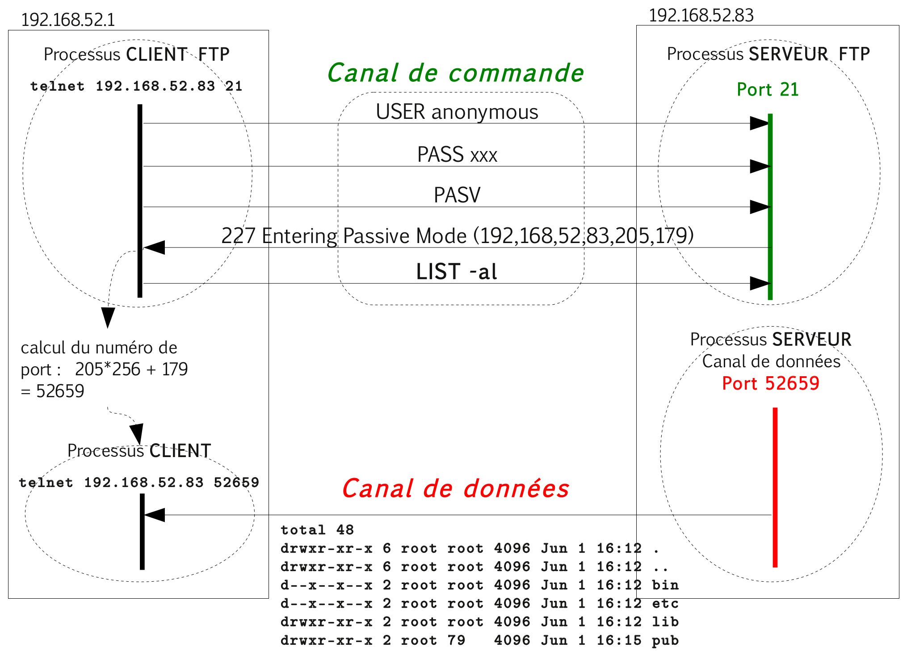

# Protocole FTP (_File Transfer Protocol_)

Le protocole [FTP](https://fr.wikipedia.org/wiki/File_Transfer_Protocol) (_File Transfer Protocol_) est un protocole de transfert de fichier ([RFC 959](https://www.rfc-editor.org/rfc/rfc959)) de la couche Application.

Le protocole FTP s'utilise de façon standard sur le port 21 du serveur en mode [TCP](https://fr.wikipedia.org/wiki/Transmission_Control_Protocol). Par contre, FTP ne fonctionne que sur du TCP.

> Il existe un protocole [TFTP](https://fr.wikipedia.org/wiki/Trivial_File_Transfer_Protocol) (_Trivial FTP_) qui est lui basé sur UDP.

Lors d'une connexion [FTP](https://fr.wikipedia.org/wiki/File_Transfer_Protocol), deux canaux de transmission sont ouverts :

- Un canal pour l'échange des commandes (canal de contrôle) : USER, PASS, LIST, RETR, STOR, ...
- Un canal pour l'échange des données

L'échange de données fonctionnant suivant le modèle client/serveur, il existe donc deux possibilités : le mode actif et le mode passif (le plus utilisé).

## Mode actif

Dans le mode actif, le client FTP (en utilisant la commande `PORT`) détermine le port d'écoute et joue le rôle de serveur pour le canal de données.

## Mode passif

Dans le mode passif, le client FTP (en utilisant la commande `PASV`) choisit le mode passif et c'est le serveur FTP qui détermine le port d'écoute et joue le rôle de serveur pour le canal de données.

> :bulb: Les commandes `PORT` et `PASV` permettent donc de déterminer l'adresse IP et le numéro de port de la machine qui jouera le rôle de serveur pour le canal de données. L'échange de ces deux informations aura le format suivant : une chaîne de caractère du type "xxx ... ... (`IP1,IP2,IP3,IP4,PORT1,PORT2`)" Il faudra donc : reconstituer l'adresse IP &rarr; `IP1.IP2.IP3.IP4` puis déterminer le numéro de port &rarr; `(PORT1 x 256) + PORT2`.

## Manipulation

## Pare-feu (firewall)

La notion de mode actif et passif est extrêmement importante pour l'utilisation de FTP avec des pare-feux (_firewall_) :

- Si le client a un _firewall_ (généralement celui-ci bloque toutes les demandes entrantes), le mode actif ne fonctionnera probablement pas car le serveur n'arrivera jamais à se connecter au client pour transférer les données (même la commande `LIST` a besoin d'un canal de données).
- Si le serveur a un _firewall_, il faut configurer celui ci pour qu'il laisse passer le port du serveur (`21`) et une plage de ports pour les transferts si le serveur accepte le mode passif.

> Le serveur doit avoir une plage de ports (entre X et Y) pour les transferts même s'il n'a qu'un seul client, car chaque commande `LIST` utilise un port de données, et un port de données ne peut plus être utilisé pendant presque une minute dans certains cas. Donc pour éviter tout problème à chaque fois que le client ou le serveur se mettent en attente, ils changent de port sans essayer de réutiliser le port précédent.

## Voir aussi

Protocole de transport :

- [TCP](tcp.md) : protocole de transport fiable en mode connecté

Boîtes à outils :

- [netcat](../../tldr/reseau/netcat.md) : utilitaire permettant d'ouvrir des connexions réseau
- [tcpdump](../../tldr/reseau/tcpdump.md) : capture et analyse le trafic réseau
- [Wireshark](../outils/../../outils/wireshark.md) : capture et analyse les trames

---
©️ 2023 LaSalle Avignon - [thierry(dot)vaira(at)gmail(dot)com](thierry.vaira@gmail.com)
