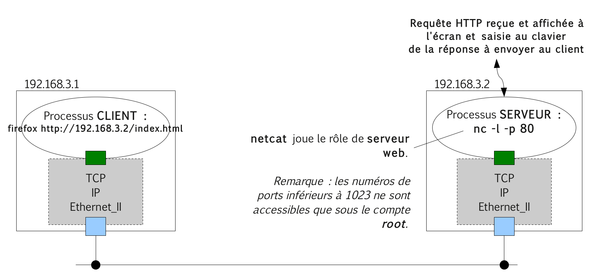

# Protocole HTTP (_HyperText Transfert Protocol_)

Le protocole [HTTP](https://fr.wikipedia.org/wiki/Hypertext_Transfer_Protocol) (_HyperText Transfert Protocol_) sert notamment au dialogue entre un client web (navigateur par exemple) et un serveur ([Apache](https://fr.wikipedia.org/wiki/Apache_HTTP_Server), [nginx](https://fr.wikipedia.org/wiki/Nginx) ou IIS par exemple). C'est un protocole de la couche Application.

[HTTP](https://fr.wikipedia.org/wiki/Hypertext_Transfer_Protocol) est un protocole orienté texte (ASCII), basé sur [TCP](https://fr.wikipedia.org/wiki/Transmission_Control_Protocol). Il existe deux spécifications la 1.0 ([RFC 1945](https://tools.ietf.org/html/rfc1945)) et la 1.1 ([RFC 2616](https://tools.ietf.org/html/rfc2616)).

Il est utilisé pour la transmission de documents distribués et multimédia.

> [HTTPS](https://fr.wikipedia.org/wiki/Hypertext_Transfer_Protocol_Secure) (avec un `S` pour _secure_, soit « sécurisé ») est la variante sécurisée par le chiffrement et l'authentification.

Les messages HTTP sont basés sur un système de requête/réponse.


## Manipulations

Un serveur HTTP utilise alors par défaut le port `80` (443 pour HTTPS).

- Côté **Serveur** :



- Côté **Client** :


```bash
# nc -l -p 80
GET /index.html HTTP/1.1
Host: localhost
User-Agent: Mozilla/5.0 (X11; U; Linux i686; en-US; rv:1.9.2.3) Gecko/20100416 Mandriva Linux/1.9.2.3-0.2mdv2009.1 (2009.1) Firefox/3.6.3
Accept: text/html,application/xhtml+xml,application/xml;q=0.9,*/*;q=0.8
Accept-Language: fr,fr-fr;q=0.8,en-us;q=0.5,en;q=0.3
Accept-Encoding: gzip,deflate
Accept-Charset: ISO-8859-1,utf-8;q=0.7,*;q=0.7
Keep-Alive: 115
Connection: keep-alive

HTTP/1.0 200 OK
Content-Type : text/html
Content-Lenght : 56

<HTML><BODY>
Bienvenue sur notre site
</BODY></HTML>
```

## Voir aussi

Protocole de transport :

- [TCP](tcp.md) : protocole de transport fiable en mode connecté

Boîtes à outils :

- [netcat](../../tldr/reseau/netcat.md) : utilitaire permettant d'ouvrir des connexions réseau
- [tcpdump](../../tldr/reseau/tcpdump.md) : capture et analyse le trafic réseau
- [Wireshark](../outils/../../outils/wireshark.md) : capture et analyse les trames

---
©️ 2023 LaSalle Avignon - [thierry(dot)vaira(at)gmail(dot)com](thierry.vaira@gmail.com)
