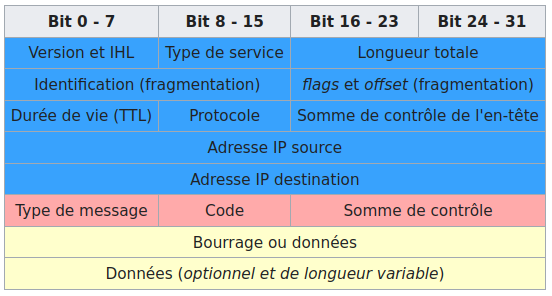

# ICMP (_Internet Control Message Protocol_)

[ICMP](https://fr.wikipedia.org/wiki/Internet_Control_Message_Protocol) est un protocole de couche Réseau, qui permet le contrôle des erreurs de transmission. En effet, comme le protocole [IP](ip.md) ne gère que le transport des paquets et ne permet pas l’envoi de messages d’erreur, c’est grâce à ce protocole qu’une machine émettrice peut savoir qu’il y a eu un incident de réseau (par exemple lorsqu’un service ou un hôte est inaccessible).

Il est détaillé dans la [RFC 792](http://tools.ietf.org/html/rfc792).

Bien qu'il soit à un niveau équivalent au protocole IP, un paquet ICMP est néanmoins encapsulé dans un paquet [IP](ip.md).

## Message ICMP



Détails : https://www.frameip.com/entete-icmp/

## ping

[ping](../../tldr/reseau/ping.md) est le nom d'une commande informatique réseau permettant d'envoyer une requête **ICMP** de demande d'ECHO (`echo-request`) d'une machine à une autre machine. Elle attend en retour une réponse **ICMP** d'ECHO (`echo-reply`). Selon la réponse (ou non), on connaît l'état de la machine distante.

Cette commande réseau de base permet d'obtenir des informations et en particulier le temps de réponse de la machine à travers le réseau et aussi quel est l'état de la connexion avec cette machine (renvoi d'un code d'erreur correspondant).

```bash
$ ping -c 1 8.8.8.8
PING 8.8.8.8 (8.8.8.8) 56(84) bytes of data.
64 octets de 8.8.8.8 : icmp_seq=1 ttl=119 temps=13.3 ms

--- statistiques ping 8.8.8.8 ---
1 paquets transmis, 1 reçus, 0 % paquets perdus, temps 0 ms
rtt min/moy/max/mdev = 13,273/13,273/13,273/0,000 ms
```

:warning: Précautions :

- En cas de succès, la commande `ping` permet de valider la pile de protocoles jusqu’au niveau IP.
- Le trafic ICMP peut être filtré par des pare-feux
- Un hôte ou routeur peut être configuré pour ne pas répondre aux `echo-request` (cf. `/proc/sys/net/ipv4/icmp_echo_ignore_all`)
- `ping` est destiné à être utilisé dans les tests, les mesures et la gestion du réseau. En raison de la charge qu'il peut imposer au réseau, il est déconseillé d'utiliser `ping` lors d'opérations normales ou à partir de scripts automatisés.

## Failles

Il existe plusieurs attaques connues contre le protocole ICMP. Parmi elles, on peut citer :

- _ICMP Sweep_ : En envoyant une série de requêtes ICMP sur un réseau, il est possible d'analyser les réponses et en déduire la structure.
- _ICMP Redirect_ : Les messages ICMP de type 5 (redirection) peuvent être utilisés de manière malhonnête pour traverser un pare-feu. L'attaque consiste à faire passer un ordinateur par un chemin détourné qui va éviter le pare-feu. La solution consiste à configurer l'ordinateur pour ignorer ce genre de message.
- Les messages ICMP de type 3 pour les codes 2 ou 3 (voire 4) peuvent clore une connexion [TCP](tcp.md).
- Un envoi répété de message ICMP de type 4 (code 0) ralentit grandement le débit d'une connexion.
- Le message ICMP de type 3 pour le code 4 ralentit une connexion en passant le [MTU](ip.md) au minimum (68 octets) puis en l'augmentant progressivement.

Et aussi : [Ping flood](https://fr.wikipedia.org/wiki/Ping_flood) et [ping de la mort](https://fr.wikipedia.org/wiki/Ping_de_la_mort)

## Voir aussi

Protocole :

- [IP](ip.md) : protocole d'acheminement des paquets à travers un réseau

Boîtes à outils :

- [ifconfig](../../tldr/reseau/ifconfig.md) : configuration des interfaces réseau
- [ip](../../tldr/reseau/ip.md) : gestion de l'adressage, le routage, les interfaces et périphériques réseau, les règles de routage et les tunnels.
- [ping](../../tldr/reseau/ping.md) : teste l'accessibilité d'une machine sur un réseau (utilise le protocole ICMP)
- [nmap](../../tldr/reseau/nmap.md) : outil d'exploration de réseau
- [netstat](../../tldr/reseau/netstat.md) : affichage d'informations et statistiques réseau
- [iptables](../../tldr/reseau/iptables.md) : configuration des règles pare-feu
- [tcpdump](../../tldr/reseau/tcpdump.md) : capture et analyse le trafic réseau
- [Wireshark](../outils/../../outils/wireshark.md) : capture et analyse les trames

---
©️ LaSalle Avignon - [thierry(dot)vaira(at)gmail(dot)com](thierry.vaira@gmail.com)
