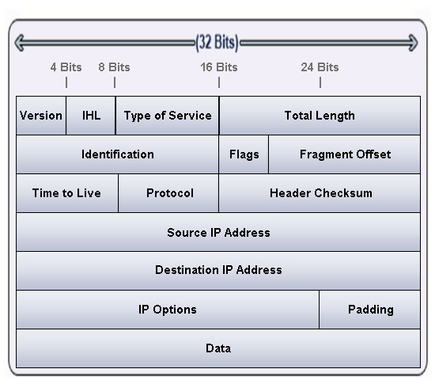
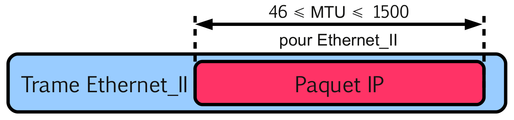

# Protocole IP (_Internet Protocol_)

La couche réseau [IP](https://fr.wikipedia.org/wiki/Internet_Protocol) assure l'acheminement des **paquets** à travers un réseau.

Ce protocole peut transférer des données pour de nombreux protocoles de plus haut niveau ([UDP](https://fr.wikipedia.org/wiki/User_Datagram_Protocol), [TCP](https://fr.wikipedia.org/wiki/Transmission_Control_Protocol), [ICMP](https://fr.wikipedia.org/wiki/Internet_Control_Message_Protocol), ...). Ces paquets sont ensuite transmis à la couche « Accès réseau » (couches Liaison et Physique du modèle OSI) afin d'y être encapsulés dans des **trames** (par exemple Ethernet).

## Paquet IPv4



Détails : https://www.frameip.com/entete-ip/

## MTU (_Maximum Transmission Unit_)

Le [MTU](https://fr.wikipedia.org/wiki/Maximum_transmission_unit) (_Maximum Transmission Unit_) est la taille maximale d'un paquet pouvant être transmis en une seule fois (sans fragmentation) sur une interface physique. Il correspond donc à la longueur en octets du champ _payload_ (DATA) de la trame qui encapsule ce paquet.



Paramétrage du MTU :

- Sous GNU/Linux :

```bash
# ifconfig eth0 mtu 100
# ip link set dev eth0 100
```

- sous Windows :

```bash
C:> netsh interface ipv4 set interface "Connexion au réseau local" mtu=100 store=persistent
```

> :bulb: Le [MSS](https://fr.wikipedia.org/wiki/Maximum_Segment_Size) (_Maximum Segment Size_) désigne la **quantité de données** en octets que peut contenir un paquet seul et non fragmenté. Le MSS pourra donc garantir une non fragmentation des paquets. Le MSS se calcule de la manière suivante : `MSS = MTU - En-tête IP - En-tête TCP`. Par exemple avec un MTU de 1500 (valeur par défaut pour ETHERNET_II et des en-têtes sans options pour TCP et IP), on aura : `MSS = 1500 - 20 - 20 = 1460` octets.

## Fragmentation

Lorsque la taille du paquet IP est plus grand que la valeur du MTU, la machine ou la passerelle (routeur) le fragmente en un certain nombre de fragments transportés par autant de trames sur le support physique.

Le destinataire final reconstitue le paquet initial à partir de l'ensemble des fragments reçus. On rappelle que les paquets peuvent emprunter des chemins différents pour atteindre une machine destinatrice.

> :exclamation: Si un seul des fragments est perdu, le paquet est considéré comme perdu.

Dans un paquet IP, les champs utilisés pour la fragmentation sont :


Exemple de manipulation avec un MTU de 1500 octets :

Le paquet est trop gros (`1473 + 20 + 8 = 1501` > MTU) et une fragmentation sera réalisée :

```bash
$ ping -­s 1473 www.google.fr
PING www.l.google.com (209.85.229.104) 1473(1501) bytes of data.
...
```

> Avec l'option `-M do`, on interdit la fragmentation.

Le paquet est trop gros (`1473 + 20 + 8 = 1501` > MTU) et une fragmentation serait nécessaire (ici le paquet n'est pas envoyé) :

```bash
$ ping -­M do -­s 1473 www.google.fr
PING www.l.google.com (209.85.229.104) 1473(1501) bytes of data.
From 192.168.52.2 icmp_seq=1 Frag needed and DF set (mtu = 1500)
```

Par contre avec un paquet égal au MTU (`1472 + 20 + 8 = 1500` == MTU) , il n' y aura pas de fragmentation :

```bash
$ ping -­M do -­s 1472 www.google.fr
PING www.l.google.com (209.85.229.104) 1472(1500) bytes of data.
64 bytes from ww­in­f104.google.com (209.85.229.104)
...
```

## TTL (_Time To Live_)

Le [TTL](https://fr.wikipedia.org/wiki/Time_to_Live) (_Time To Live_) est l'expression en secondes (ou en nombre de routeurs traversés) de la durée maximale de séjour du paquet dans un réseau. Chaque routeur qui traite ce paquet décrémente le TTL d'une unité (compteur de routeurs). Si le TTL devient nul, son paquet IP n'est plus relayé (indication d'une erreur de paquet qui boucle). Le routeur détruit alors le paquet et retourne un paquet ICMP d'erreur vers l'émetteur.

Une utilisation détournée de ce champ permet de "tracer" la route empruntée par un paquet (voir la commande `traceroute` ou `tracert`).

La valeur initiale du TTL est généralement fixée par le système d’exploitation et la valeur recommandée par le RFC 1700 est de `64`. Dans l'exemple ci-dessous, on reçoit un `echo reply` avec un TTL égal à `62`. Donc `64 - 62 = 2` routeurs ont été traversés.

```bash
$ ping 172.16.1.2 -c 1
PING 172.16.1.2 (172.16.1.2) 56(84) bytes of data.
64 bytes from 172.16.1.2: icmp_seq=1 ttl=62 time=0.425 ms
```

Avec la commande `ping`, on utiliser l’option `-t` pour indiquer une valeur de TTL :

```bash
$ ping 172.16.1.2 -c 1 -t 1
PING 172.16.1.2 (172.16.1.2) 56(84) bytes of data.
From 192.168.1.2 icmp_seq=1 Time to live exceeded
1 packets transmitted, 0 received, +1 errors, 100% packet loss, time 0ms

$ ping 172.16.1.2 -c 1 -t 2
PING 172.16.1.2 (172.16.1.2) 56(84) bytes of data.
From 10.3.0.1 icmp_seq=1 Time to live exceeded
1 packets transmitted, 0 received, +1 errors, 100% packet loss, time 0ms

$ ping 172.16.1.2 -c 1 -t 3
PING 172.16.1.2 (172.16.1.2) 56(84) bytes of data.
64 bytes from 172.16.1.2: icmp_seq=1 ttl=62 time=0.425 ms
1 packets transmitted, 1 received, 0% packet loss, time 0ms
rtt min/avg/max/mdev = 0.425/0.425/0.425/0.000 ms
```

On obtient la "route" suivante :  `192.168.1.2 - 10.3.0.1 - 172.16.1.2`

## Voir aussi

Protocole :

- [ICMP](icmp.md) : protocole de message de contrôle et d'erreurs, associé à IP

Boîtes à outils :

- [ifconfig](../../tldr/reseau/ifconfig.md) : configuration des interfaces réseau
- [ip](../../tldr/reseau/ip.md) : gestion de l'adressage, le routage, les interfaces et périphériques réseau, les règles de routage et les tunnels.
- [ping](../../tldr/reseau/ping.md) : teste l'accessibilité d'une machine sur un réseau (utilise le protocole ICMP)
- [nmap](../../tldr/reseau/nmap.md) : outil d'exploration de réseau
- [netstat](../../tldr/reseau/netstat.md) : affichage d'informations et statistiques réseau
- [iptables](../../tldr/reseau/iptables.md) : configuration des règles pare-feu
- [tcpdump](../../tldr/reseau/tcpdump.md) : capture et analyse le trafic réseau
- [Wireshark](../outils/../../outils/wireshark.md) : capture et analyse les trames

---
©️ LaSalle Avignon - [thierry(dot)vaira(at)gmail(dot)com](thierry.vaira@gmail.com)
