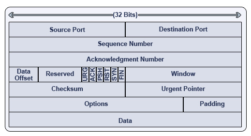

# Modèles de référence

Un modèle de référence est utilisé pour décrire la structure et le fonctionnement des communications réseaux.

On connaît principalement deux modèles :

- Le modèle [OSI](https://fr.wikipedia.org/wiki/Mod%C3%A8le_OSI) (_Open Systems Interconnect_) qui correspond à une approche plus théorique en décomposant le fonctionnement en une pile de 7 couches.

- Le modèle [DoD](https://fr.wikipedia.org/wiki/Suite_des_protocoles_Internet) (_Department Of Defense_) (ou "TCP/IP") qui répond à un problème pratique comprenant une pile de 4 couches pour décrire les réseaux basés sur la la famille des protocoles TCP/IP (le réseau public Internet ou Intranet en version interne).

> C'est le modèle "TCP/IP" qui l'emporte sur le marché et celui qui est implanté sur Internet. Le modèle OSI est principalement utilisé comme modèle abstrait. Rappelons que le modèle "TCP/UP" est antérieur au modèle OSI et tenter de les faire correspondre peut induire en erreur.

## Protocoles

Les protocoles rendent possible le dialogue entre des machines différentes en définissant les règles pour réaliser une communication.

Cela comprend :

- Le dictionnaire : la liste des primitives (comme demande connexion, acquittement, ...)
- Le scénario du dialogue : l’enchaînement des primitives (le séquencement est représentable par un diagramme de l’échange)
- Les modalités : la taille et la représentation des informations, temps d’attente, etc ...
- Les messages échangés : les différents champs composant le bloc d’informations (taille et contenu)

Le bloc d’informations défini par un protocole réseau est constitué de deux parties :

- Le modèle [OSI](https://fr.wikipedia.org/wiki/Mod%C3%A8le_OSI)

  - un PCI (_Protocol Control Information_) : les informations propres au protocole utilisé
  - un PDU (_Protocol Data Unit_) : les données "réseau" transportées qui réprésentent un bloc de couche supérieure (principe d'encapsulation).

- Le modèle [DoD](https://fr.wikipedia.org/wiki/Suite_des_protocoles_Internet)

- un _header_ (entête) : les informations propres au protocole utilisé
- un _payload_ (Data) : les données "réseau" transportées qui réprésentent un bloc de couche supérieure (principe d'encapsulation).

Termes utilisées pour représenter ce bloc : trame ([Ethernet(https://fr.wikipedia.org/wiki/Ethernet)]), paquet ([IP](ip.md)), datagramme ([IP](ip.md), [UDP](udp.md)), segment ([TCP](tcp.md)), message ([ICMP](icmp.md), etc.), ...

Exemple pour le protocole [TCP](tcp.md) :

---
©️ LaSalle Avignon - [thierry(dot)vaira(at)gmail(dot)com](thierry.vaira@gmail.com)
