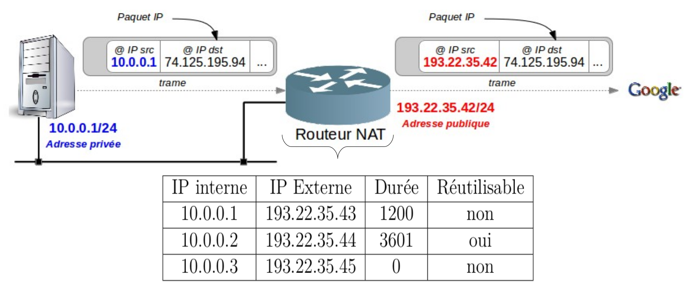
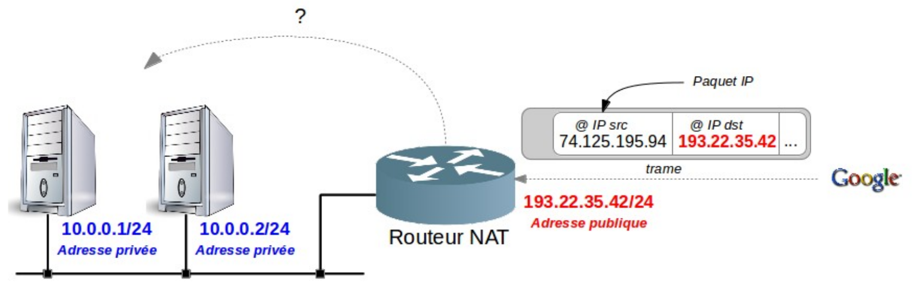
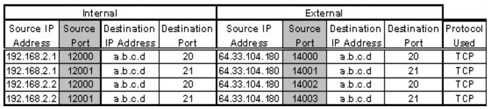

# NAT (_Network Address Translation_)

Un routeur fait du [NAT]https://fr.wikipedia.org/wiki/Network_address_translation (_Network Address Translation_ soit « traduction d’adresse réseau ») lorsqu’il fait correspondre les adresses IP internes privées (non-uniques et souvent non routables) d’un intranet à un ensemble d’adresses externes publiques (uniques et routables).

Ce mécanisme permet notamment de faire correspondre une seule adresse externe publique visible sur Internet à toutes les adresses d’un réseau privé, et pallie ainsi l’épuisement des adresses IPv4.

## NAT statique

La NAT statique, se base sur l’association de **N** adresses internes avec **N** adresses externes. C’est à dire qu’à UNE adresse IP interne, on associe UNE adresse IP externe.

Dans ce cas, la seule action qui sera effectuée par le routeur sera de remplacer l’adresse source ou destination par l’adresse correspondante.

Les correspondances entre les adresses privées (internes) et publiques (externes) sont stockées dans une table sous forme de paires (adresse interne, adresse externe).

> :bulb: Ces NAT servent à donner accès à des serveurs en interne (DMZ) à partir de l’extérieur. Si l'on s'en tient intrinsèquement à la dénition du terme NAT, cela représente la modication des adresses IP dans l'en-tête d'un datagramme IP effectuée par un routeur. On parlera de SNAT quand c'est l'adresse source du paquet qui est modifiée, et de DNAT quand il s'agit de l'adresse destination.

## NAT dynamique

La NAT dynamique est aussi appelée _IP masquerading_. Contrairement à la NAT statique, la  NAT dynamique associe **M** adresses internes à **N** adresses externes où **M > N** (les adresses pour sortir étant choisies dans un _pool_). Ainsi, on peut associer UNE adresse publique à M adresses privées et permettre ainsi à un grand nombre de machines ayant des adresses privées d’accéder à Internet.

> :point_right: Les adresse internes des machines se retrouvent ainsi masquées derrière une seule adresse publique. Cela a un effet sur la sécurité car les adresses internes sont ainsi dissimulées.

Contrairement à la NAT statique, la NAT dynamique va modifier aussi les ports TCP/UDP que l'on appelle PAT (_Port Address Translation_).

Ce sont les numéros de ports qui vont servir à résoudre le problème d’identification des adresses internes : le numéro du port source (celui de la machine interne) va être modifié par le routeur (un nouveau qu’il choisit lui-même). Il va s’en servir pour identifier la machine interne.

## Port forwarding

Le _port forwarding_ est une solution pour joindre des machines internes (serveurs) à partir d’Internet avec la NAT dynamique. Cela consiste à rediriger un paquet vers une machine précise en fonction du port de destination de ce paquet (une seule par port TCP/UDP).

## IPv6

L’IETF décourage le NAT avec IPv6 en raison des problèmes liés à certains protocoles et du fait que l’espace d’adresse IPv6 est tel que l’économie d’adresse n’est pas nécessaire.

---
©️ 2023 LaSalle Avignon - [thierry(dot)vaira(at)gmail(dot)com](thierry.vaira@gmail.com)
