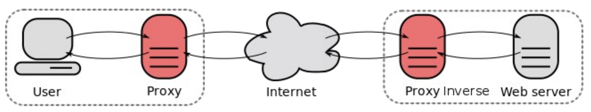
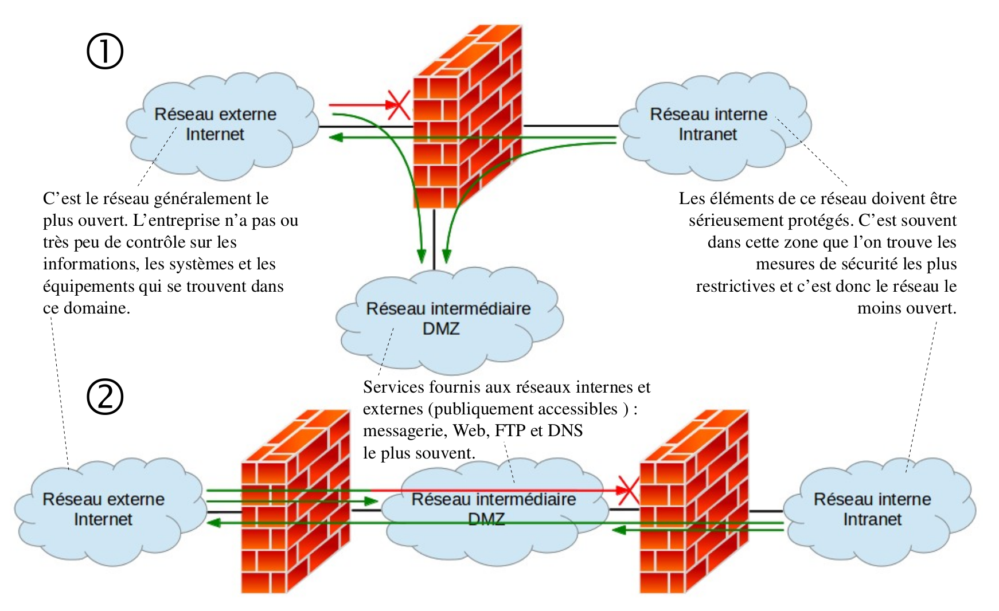
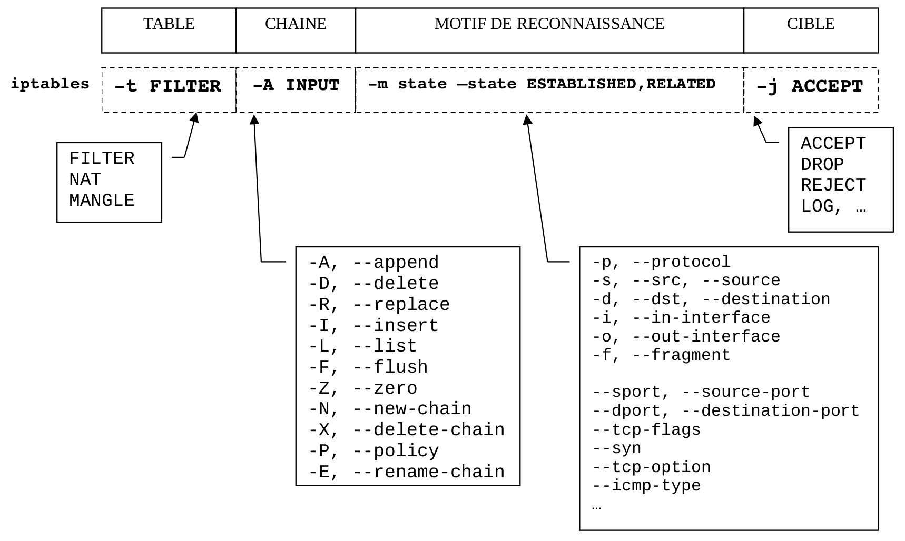

# Pare-feu (_firewall_)

Un système [pare-feu](https://fr.wikipedia.org/wiki/Pare-feu_(informatique)) (_firewall_) est un dispositif conçu pour examiner et éventuellement bloquer les échanges de données entre réseaux.


C’est donc un élément de sécurité d’un réseau qui peut être : un ordinateur, un routeur, un matériel propriétaire. Dans tous les cas, un système pare-feu est une combinaison d’éléments matériels et logiciels.

Le pare-feu joue le rôle de filtre et peut donc intervenir à plusieurs niveaux du modèle à couches (OSI ou DoD).

Il existe trois types de principaux de pare-feu :

- filtrage de paquets (_firewall_)
- filtrage de paquets avec état (_firewall stateful_)
- _proxy_

## Filtrage de paquets

Les pare-feu de filtrage de paquets (_packet filter_) sont généralement des routeurs qui permettent d’accorder ou de refuser l’accès en fonctions des éléments suivants :

- l’adresse source et/ou l’adresse destination
- le protocole
- le numéro de port

## Firewall Stateful

Un _firewall stateful_ inclut toutes les fonctionnalités d’un filtrage de paquet, auxquelles il ajoute la capacité de conserver la trace des sessions et des connexions dans des tables d’état interne. Tout échange de données est soumis à son approbation et adapte son comportement en fonction des états.

Cette technique convient aux protocoles de type connecté (TCP).

Certains protocoles (UDP et ICMP) posent un problème supplémentaire : aucune notion de connexion n’y est associée. Le _firewall_ est donc amené à examiner les paquets, et peut seulement gérer des _timeout_, souvent de l’ordre d’une minute.

## Proxy

Ces systèmes se substituent au serveur ou au client qu’ils ont pour mission de défendre pour :

- traiter les requêtes et réponses à la place du système à protéger,
- les transmettre, après d’éventuelles modifications
- ou les bloquer

Les pare-feu de ce type jouent le rôle de canal et d’interpréteur en agissant aux niveaux des protocoles de la couche Application.



## DMZ (_DeMilitarized Zone_)

Une [DMZ](https://fr.wikipedia.org/wiki/Zone_d%C3%A9militaris%C3%A9e_(informatique)) (une zone démilitarisée) est un sous-réseau intermédiaire entre un réseau interne, dit de confiance, et un réseau externe non maîtrisé, donc potentiellement dangereux.

La [DMZ](https://fr.wikipedia.org/wiki/Zone_d%C3%A9militaris%C3%A9e_(informatique)) isole les machines à accès public (serveurs) du réseau interne. La mise en place d’une [DMZ](https://fr.wikipedia.org/wiki/Zone_d%C3%A9militaris%C3%A9e_(informatique)) est la première étape de la sécurisation d'un réseau.

On distingue deux types d'architecture :



## Politique de sécurité

- Politique permissive (_open config_) :

Cette politique repose sur le principe que par défaut on laisse tout passer puis on va restreindre pas à pas les accès et les services mais la sécurité risque d’avoir des failles.

- Politique stricte (_close config_) :

Cette politique repose sur le principe inverse : on commence par tout interdire, puis on décide de laisser seulement passer les services ou adresses désirés ou indispensables. La sécurité sera meilleure mais le travail sera plus difficile et cela peut même bloquer plus longtemps que prévu les utilisateurs. C’est évidemment la politique conseillée pour un pare-feu.

## iptables

[iptables](https://fr.wikipedia.org/wiki/Iptables) est un logiciel libre GNU/Linux permettant à l'administrateur système de
configurer les règles du pare-feu. Le noyau GNU/Linux possède une couche _firewalling_ basée sur **Netfilter**. Netfilter possède une architecture modulaire.

[iptables](https://fr.wikipedia.org/wiki/Iptables) gère des tables (des tableaux) qui contiennent des « chaînes », elles-mêmes composées d'un ensemble de règles de traitement des paquets.

Chaque table est associé à un type de traitement des paquets :

- FILTER : pour les opérations de filtrage de paquets (table par défaut)
- NAT (_Network Address Translation_) : pour les opérations de traduction d’adresses
- MANGLE : pour modifier les en-têtes des paquets

Les cinq chaînes prédéfinies sont les suivantes :

- PREROUTING : les paquets avant qu'une décision de routage ne soit prise
- INPUT : les paquets à destination de la machine
- FORWARD : les paquets traversant (routés par) la machine = ROUTEUR FILTRANT
- OUTPUT : les paquets émis par la machine
- POSTROUTING : les paquets avant qu'ils ne soient transmis vers le matériel

Les paquets suivent séquentiellement chaque règle des chaînes. Une règle spécifie ce qu'il faut tester dans chaque paquet et ce qu'il faut faire d'un tel paquet. Une règle dans une chaîne peut provoquer un saut à une autre chaîne.

Chaque paquet réseau, entrant ou sortant, traverse donc au moins une chaîne. Tout paquet traité par le système traversera une et une seule chaîne.

Exemple : La table FILTER

C’est la table qui permet les opérations de filtrage IP. Les paquets y sont acceptés (ACCEPT), refusés (DROP ou REJECT avec renvoi d’un paquet erreur), logués (LOG) ou encore mis en queue (QUEUE), mais jamais modifiés. Cette table contient trois chaînes
de base : INPUT, FORWARD et OUTPUT.



Initialisation :

```bash
# Choix de la configuration par défaut :
# DROP ­> close config
# ACCEPT ­> open config
POLICY="DROP"
# politique par défaut pour FILTER
iptables -P INPUT $POLICY
iptables -P FORWARD $POLICY
iptables -P OUTPUT $POLICY
# politique par défaut pour NAT
#iptables -t NAT -P PREROUTING $POLICY
#iptables -t NAT -P POSTROUTING $POLICY
#iptables -t NAT -P OUTPUT $POLICY
# politique par défaut pour MANGLE
#iptables -t MANGLE -P PREROUTING $POLICY
#iptables -t MANGLE -P OUTPUT $POLICY
# on vide (flush) toutes les règles existantes
iptables -P
iptables -t NAT -F
iptables -t MANGLE -F
# on efface toutes les chaînes
iptables -X
iptables -t NAT -X
iptables -t MANGLE -X
```

Tests :

```bash
# On affiche toutes les règler de toutes les chaînes
iptables -L -v

# On interdit tout ce qui sort de l’interface loopback
iptables -A OUTPUT -o lo -j DROP
ping 127.0.0.1

# et on supprime la règle
iptables -D OUTPUT 1

# On interdit tout ce qui rentre du réseau
iptables -A INPUT -s 0/0 -j DROP
ping 127.0.0.1

# On interdit tout ce qui rentre du réseau 192.168.1.0
iptables -A INPUT -s 192.168.1.0/24 -j DROP
ping 192.168.1.2

# On interdit tout ce qui sort du réseau 192.168.1.0
iptables -A INPUT -d 192.168.1.0/24 -j DROP
ping 192.168.1.2

# On interdit toutes les requêtes echo (ping)
iptables -A INPUT -p icmp --icmptype 8 -j DROP

# On interdit toutes les réponses echo (ping)
iptables -A INPUT -p icmp --icmptype 0 -j DROP
```

---
©️ 2023 LaSalle Avignon - [thierry(dot)vaira(at)gmail(dot)com](thierry.vaira@gmail.com)
