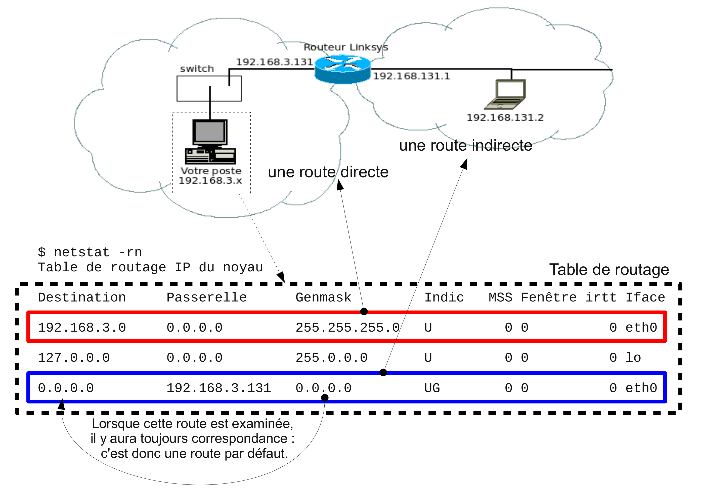
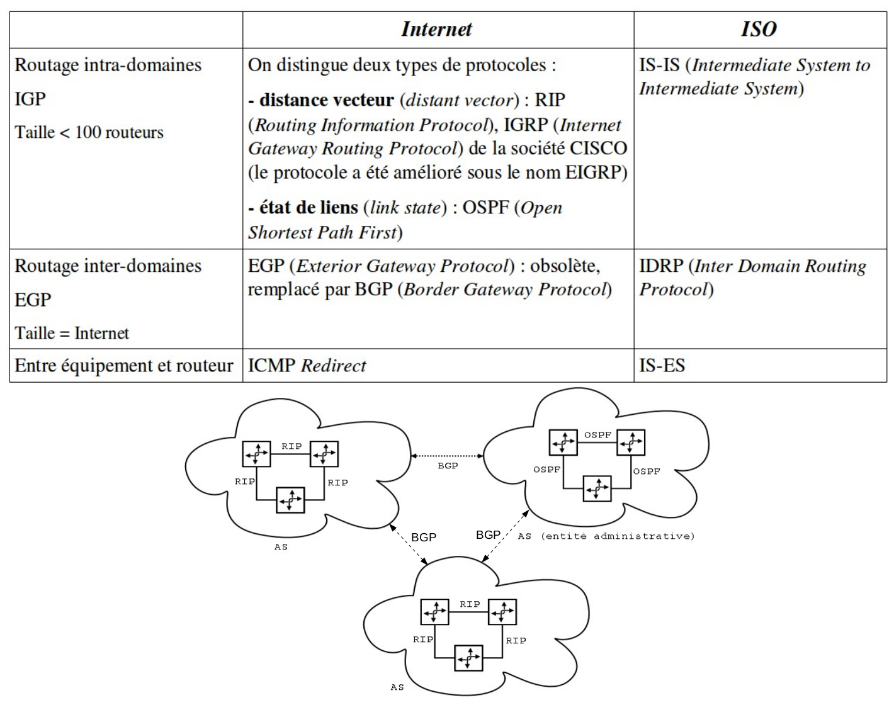

# Routage

Le routage consiste à déterminer la **route** (le chemin) qu'un paquet doit prendre pour atteindre une destination.

Pour déterminer la route à prendre, le pilote IP utilise sa **table de routage** qui indique pour chaque destination (hôte, réseau ou sous-réseau), la route (interface et/ou passerelle) à prendre : routage de proche en proche.

## Types de machine

Pour effectuer le routage, on considère deux types de machines ou composants du réseau :

- les **routeurs** qui servent d'intermédiaire dans la transmission d'un paquet
- les **hôtes** qui émettent ou reçoivent les paquets

Une [table de routage](routage-statique.md) contient une liste de routes de deux types :

- les **routes directes** correspondant à des réseaux directement connectés
- les **routes indirectes** correspondant à des réseaux distants nécessitant une interconnexion par routeurs

> :warning: Tous les équipements (hôtes et routeurs) d'un réseau IP possèdent une table de routage.

:exclamation:Un routeur se distingue simplement d'un hôte par sa capacité à retransmettre (_forwarding_) des paquets qui ne lui sont pas destinés (adressés).

Le routage est un processus décentralisé, c'est-à-dire que chaque routeur possède des informations sur son voisinage.

Chaque routeur maintient une liste des réseaux connus, chacun de ces réseaux étant associé à un ou plusieurs routeurs voisins à qui le paquet peut être passé.

## Routage dynamique

On distingue aussi :

- les [routes statiques](routage-statique.md) : configurées en "dur" sur le routeur par l'administrateur du réseau,
- les **routes dynamiques** : apprises d'un protocole de routage dynamique dont le rôle est de diffuser les informations concernant les réseaux disponibles :

|Avantages|Inconvénients|
|---|---|
|Simplicité de la configuration|Dépend du protocole de routage utilisé et de la taille du réseau :|
|Adaptabilité à l'évolution du réseau|consommation de la bande passante|
|Optimisation (sélection des meilleures routes)|temps de convergence|
|Élimination des boucles de routage|sécurité|

## Les protocoles de routage dynamique

Il faut distinguer deux types de domaine de routage :

- [IGP](https://fr.wikipedia.org/wiki/Interior_gateway_protocol) (_Interior Gateway Protocol_) : protocole de routage interne utilisé au sein d'une même unité administrative ([AS](https://fr.wikipedia.org/wiki/Autonomous_System), _Autonomous System_)
- [EGP](https://fr.wikipedia.org/wiki/Exterior_gateway_protocol) (_Exterior Gateway Protocol_) : protocole de routage externe utilisé entre passerelles appartenant à des unités administratives différentes (AS), tels que [BGP](https://fr.wikipedia.org/wiki/Border_Gateway_Protocol) (_Border Gateway Protocol_)

## Les algorithmes de routage

### Distant Vector

Un protocole de type distance-vecteur sélectionne une route si elle est la plus courte en terme de distance (ou _Metric_) en se basant sur l'algorithme de Belleman-Ford. 

La distance est le nombre de routeurs (sauts ou « _hops_ ») pour joindre une destination, chaque routeur ne connaît que son voisinage et propage les routes qu'il connaît à ses voisins.

- [RIP](https://fr.wikipedia.org/wiki/Routing_Information_Protocol) (_Routing Information Protocol_) est un protocole basé sur un algorithme de type Distant-Vector, créé à l'Université de Berkeley (RFC1058).

À chaque route (@IP + netmask) est associée une métrique (M) qui est sa distance exprimée en nombre de routeurs à traverser (sauts ou « hops »), 16 étant l'infini.

Avec RIPv2, chaque routeur envoie à ses voisins (adresse [_multicast_](https://fr.wikipedia.org/wiki/Multicast) `224.0.0.9`) ses informations de routage (les réseaux qu'il sait router et métriques associées) : toutes les 30 secondes systématiquement.

Un message RIPv2 comprend un en-tête suivi de 1 à 25 enregistrement(s) de route (24 si un message  d'authentification est requis).

Si un routeur reçoit d'un voisin ses informations de routage, il calcule les métriques locales des routes apprises (M -> M+1), sélectionne les meilleures routes, en déduit sa table de routage et envoie à ses voisins ses nouvelles informations de routage (si elles ont changées), mécanisme _Triggered Updates_ (mises à jour déclenchées).

### Link State

Un protocole de type link-state ou SPF (_Shortest Path First_) repose sur la recherche de la route la plus courte en se basant sur l'algorithme de Dijkstra. Cet algorithme implique une vision globale du réseau : chaque routeur ayant une vision topologique du réseau et l'état de l'ensemble des liens.

- [OSPF](https://fr.wikipedia.org/wiki/Open_shortest_path_first) (_Open Shortest Path First)_ est un protocole ouvert de routage interne de type Link-State, élaboré par l'IETF (RFC 1247).

Chaque routeur doit établir la liste des routeurs (en s'annonçant à ses voisins avec des paquets HELLO toutes les 10 secondes en [_multicast_](https://fr.wikipedia.org/wiki/Multicast) `224.0.0.5`), élire le routeur désigné (_Designated Router_) et le routeur désigné de secours (_Backup Designated Router_), découvrir les routes (paquets LSA _Link State Advertisement_, LSR _Link State Request_ et LSU _Link state Update_) afin
de constituer la carte topologique (relation maître/esclave entre le DR et chaque routeur) et élire les routes à utiliser. À partir de la carte topologique et avec l'algorithme SPF, le routeur construit sa table de routage.

Pour maintenir la carte topologique du réseau, chaque routeur surveille activement l'état de toutes ses liaisons (liens), diffuse (paquets LSU _Link state Update_) cet état au routeur désigné ([_multicast_](https://fr.wikipedia.org/wiki/Multicast) `224.0.0.6`), puis celui-ci diffuse l'information aux routeurs ([_multicast_](https://fr.wikipedia.org/wiki/Multicast) `224.0.0.5`). Il reconstruit à partir de ces informations une carte topologique complète du réseau et recalcule les routes de plus court chemin.

> Voir aussi : [IS-IS](https://fr.wikipedia.org/wiki/IS-IS)

## IRDP (_ICMP Router Discover Protocol_)

Le protocole IRDP permet à un hôte de découvrir les différentes passerelles présentes sur son réseau local et ainsi de mettre à jour sa route par défaut.

Un hôte se met à l'écoute du groupe [_multicast_](https://fr.wikipedia.org/wiki/Multicast) `224.0.0.1` et attend les messages ICMP _Router Advertisement_ émis par les routeurs présents sur le réseau local. L'hôte peut émettre des messages ICMP _Router Solicitation_ vers `224.0.0.2` pour demander aux routeurs de se faire connaître.

> cf. La commande `rdisc` sous GNU/Linux.

## Voir aussi

- [routage statique](routage-statique.md)

---
©️ LaSalle Avignon - [thierry(dot)vaira(at)gmail(dot)com](thierry.vaira@gmail.com)
