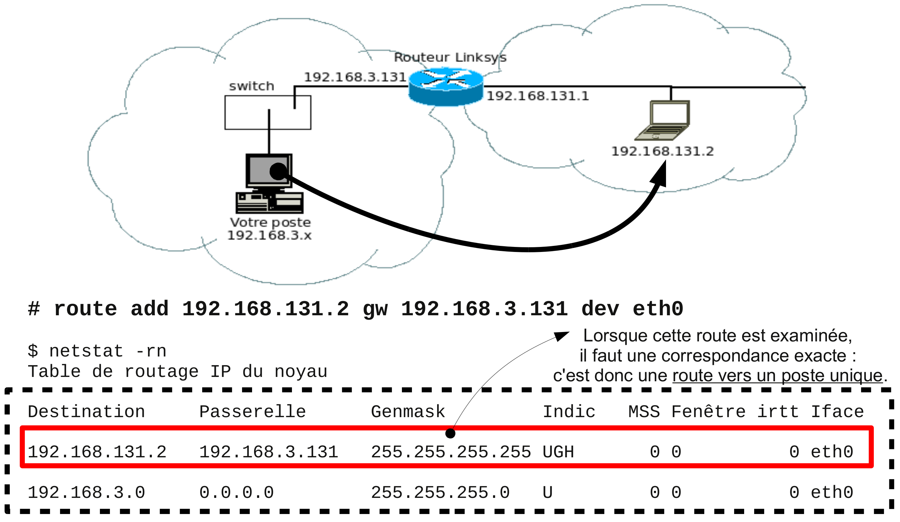
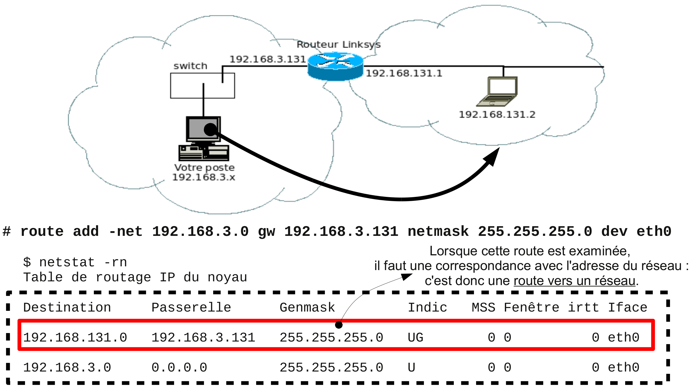

# Routage

Le routage est le mécanisme par lequel des chemins (routes) sont sélectionnés pour acheminer les données d'un expéditeur jusqu'à un ou plusieurs destinataires.

Les fonctions au niveau de la couche RESEAU sont :

- acheminer (hôte ou routeur) : envoyer un paquet vers une destination (hôte ou routeur)
- relayer (routeur) : acheminer un paquet d’un réseau vers un autre réseau (_forwarding_)

Pour déterminer la route à prendre, le pilote IP utilise sa table de routage qui indique pour chaque destination (hôte, réseau ou sous-réseau), la route (interface ou passerelle) à prendre : routage de proche en proche.

## Types de machine

Pour effectuer le routage, on considère deux types de machines ou composants du réseau :

- les **routeurs** qui servent d'intermédiaire dans la transmission d'un paquet
- les **hôtes** qui émettent ou reçoivent les paquets

Une **table de routage** contient une liste de routes de deux types :

- les **routes directes** correspondant à des réseaux directement connectés
- les **routes indirectes** correspondant à des réseaux distants nécessitant une interconnexion par routeurs

> :warning: Tous les équipements (hôtes et routeurs) d'un réseau IP possèdent une table de routage.

:exclamation:Un routeur se distingue simplement d'un hôte par sa capacité à retransmettre (_forwarding_) des paquets qui ne lui sont pas destinés (adressés).

Le routage est un processus décentralisé, c'est-à-dire que chaque routeur possède des informations sur son voisinage.

Chaque routeur maintient une liste des réseaux connus, chacun de ces réseaux étant associé à un ou plusieurs routeurs voisins à qui le paquet peut être passé.

## Relayer (_forwarding_)

Activer le routage (_IP Forwarding_) :

- `# echo "1" > /proc/sys/net/ipv4/ip_forward` ou
- `# sysctl -n -w net.ipv4.ip_forward=1`

Activer le routage (_IP Forwarding_) de manière permanente (prise en compte au démarrage du service réseau) :

- dans le fichier `/etc/sysconfig/network` : `FORWARD_IPV4=yes`
- dans le fichier `/etc/sysctl.conf` : `net.ipv4.ip_forward = 1`

## Routage statique

On distingue aussi :

- les **routes statiques** : configurées en "dur" sur le routeur par l'administrateur du réseau,
- les **routes dynamiques** : apprises d'un protocole de routage dynamique dont le rôle est de diffuser les informations concernant les réseaux disponibles.

## Table de routage

Une table de routage indique pour chaque destination (hôte, réseau ou sous-réseau) la route (interface ou passerelle) qu'il faut prendre.

Les informations pour chaque route sont donc les suivantes :

|Aller vers|Passer par|
|:---:|:---:|
|la destination (hôte ou réseau)|la **route**|
|Champs : _Destination_ et _Genmask_|Champs : _Passerelle_ et _Iface_|

A chaque fois que le poste désire envoyer un paquet vers une adresse IP destination, il interroge sa table de routage pour trouver une route afin de délivrer son paquet.

## Principe

À partir des champs `Destination` et `Genmask`, l'algorithme de routage permettra de rechercher et trouver UNE ROUTE renseignée dans la table de routage. Une fois la route trouvée, on exploitera alors les champs `Passerelle` et `Iface` pour envoyer le paquet.


Pour visualiser la table de routage, on utilise la commande `route` ou `netstat -r` :

```bash
$ route -n
Table de routage IP du noyau
Destination     Passerelle      Genmask         Indic Metric Ref    Use Iface
0.0.0.0         192.168.52.1    0.0.0.0         UG    100    0        0 enp4s0
169.254.0.0     0.0.0.0         255.255.0.0     U     1000   0        0 enp4s0
192.168.1.0     0.0.0.0         255.255.255.0   U     600    0        0 wlp3s0
192.168.52.0    0.0.0.0         255.255.255.0   U     100    0        0 enp4s0

$ netstat -rn
Table de routage IP du noyau
Destination     Passerelle      Genmask         Indic   MSS Fenêtre irtt Iface
0.0.0.0         192.168.52.1    0.0.0.0         UG        0 0          0 enp4s0
169.254.0.0     0.0.0.0         255.255.0.0     U         0 0          0 enp4s0
192.168.1.0     0.0.0.0         255.255.255.0   U         0 0          0 wlp3s0
192.168.52.0    0.0.0.0         255.255.255.0   U         0 0          0 enp4s0
```

> L'option `-n` désactive la résolution des adresses IP en nom.

## Types de route

On peut indiquer trois types de route indirecte dans une table de routage :

- route vers un poste



```bash
# route add 192.168.131.2 gw 192.168.3.131 dev eth0
```

- route vers un réseau



```bash
# route add -net 192.168.3.0 gw 192.168.3.131 netmask 255.255.255.0 dev eth0
```

- route par défaut :

Pour ajouter une route par défaut dans sa table de routage, on utilise la commande `route` :

```bash
# route add default gw 192.168.3.131 dev eth0
```

> :warning: L'adresse d'une passerelle (_gateway_) de la table de routage est toujours une adresse IP "joignable" par une route directe.

## Voir aussi

La reconfiguration manuelle des tables de routage en cas de défaillance d’un routeur peut vite devenir fastidieuse.

Il existe plusieurs protocoles de [routage dynamique](routage-dynamique.md) comme **RIP** (_Routing Information Protocol_) ou **OSPF** (_Open Shortest Path First_), afin d’éviter la configuration manuelle et de gérer dynamiquement les tables de routage des routeurs.

---
©️ LaSalle Avignon - [thierry(dot)vaira(at)gmail(dot)com](thierry.vaira@gmail.com)
