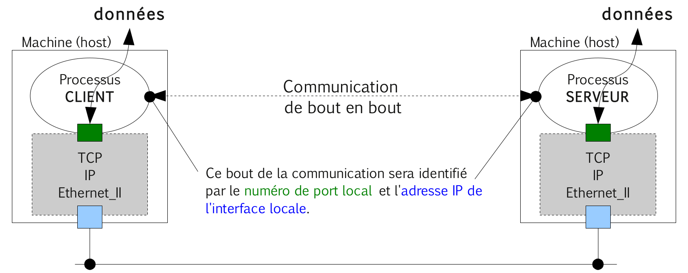
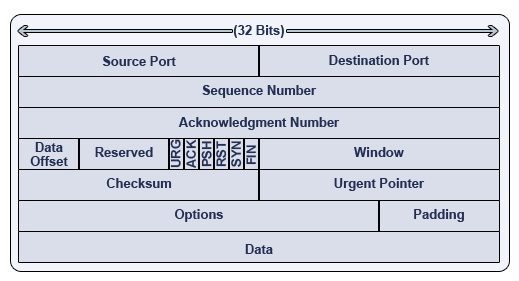
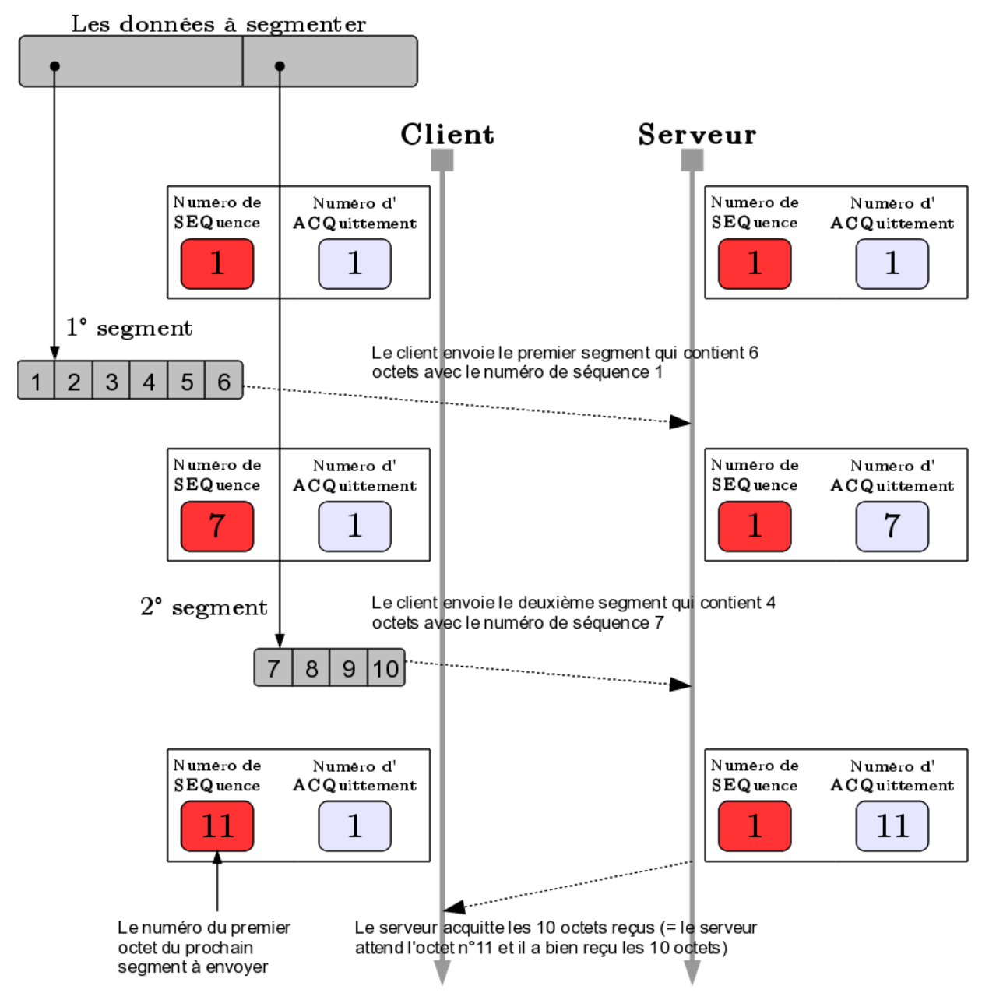
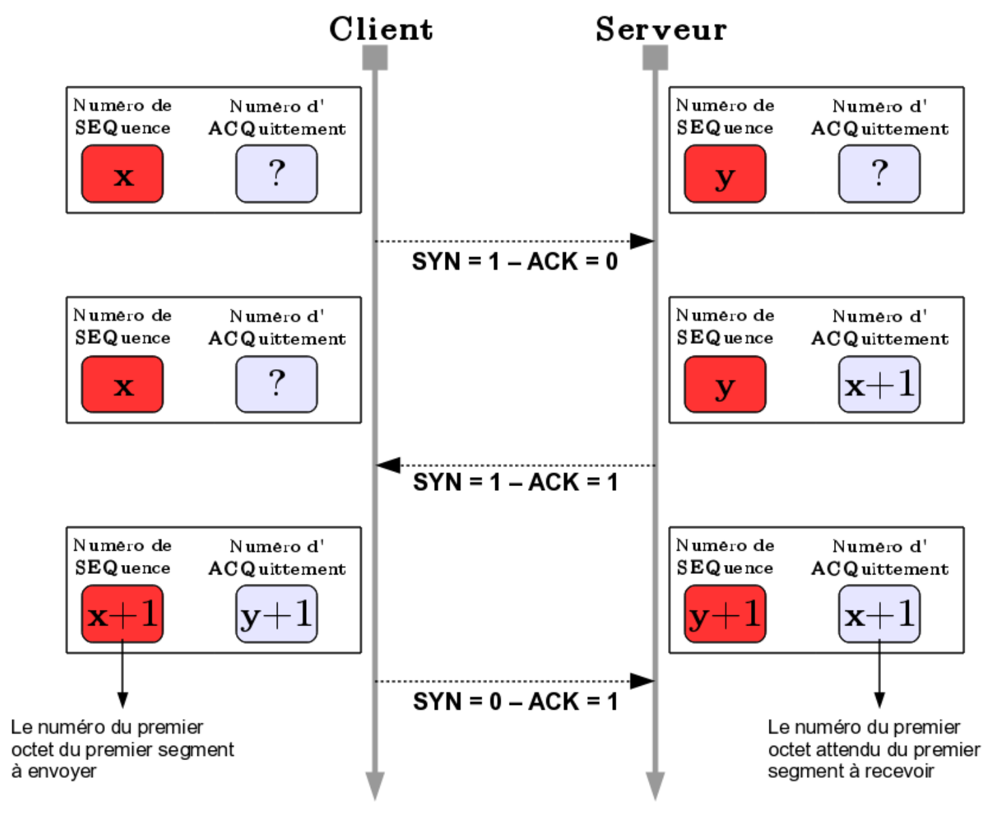
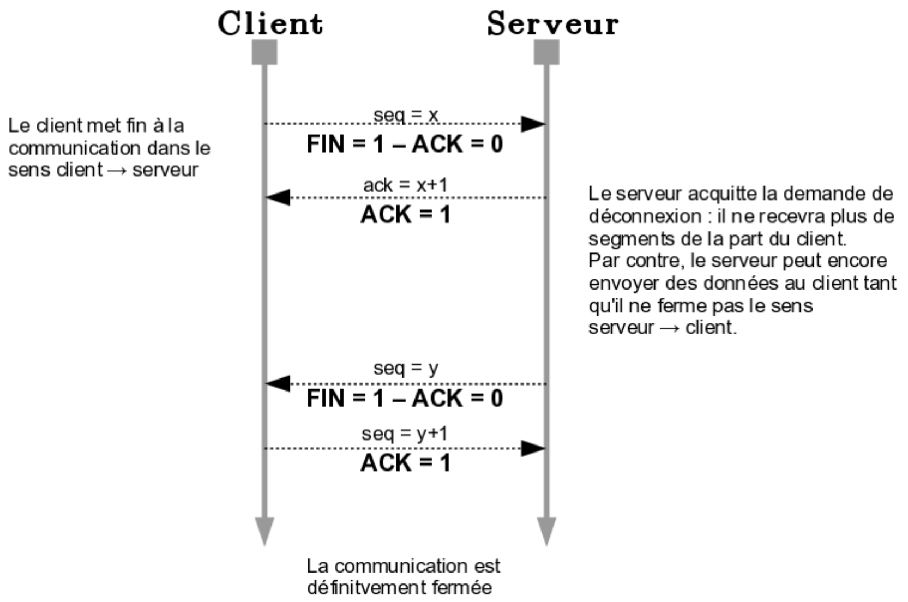
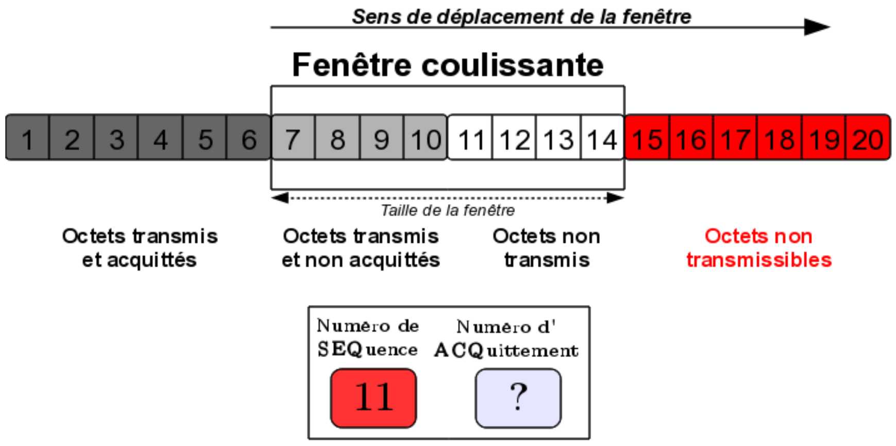

# Protocole TCP (_Transmission Control Protocol_)

[TCP](https://fr.wikipedia.org/wiki/Transmission_Control_Protocol) (_Transmission Control Protocol_) est un protocole de transport fiable, en mode connecté ([RFC 793](https://tools.ietf.org/html/rfc793)) qui assure la transmission des données de bout en bout (d'un processus à un autre processus).



## Datagramme TCP



Détails : https://www.frameip.com/entete-tcp/

Les 6 drapeaux (_flags_) sont essentiels dans la gestion d'une communication TCP :

- `0x20` URG : valide le champ _Pointeur Urgent_
- `0x10` ACK : valide le champ _Acknowledgment Number_
- `0x08` PSH : indique au récepteur de délivrer immédiatement les données en attente
- `0x04` RST : demande au récepteur une réinitialisation de la connexion ou met fin à une demande
- `0x02` SYN : demande une synchronisation du _Sequence Number_ (connexion TCP)
- `0x01` FIN : l'émetteur demande une déconnexion TCP

> Ils sont notamment testés par les systèmes de pare-feu (_firewall_) lors des échanges.

## Segment TCP

Une communication TCP est bidirectionnelle _full duplex_ (flux d'octets).

Les données en octets sont préalablement découpées en **segments**. Un segment TCP sera transporté au travers du réseau par un
paquet IP.

TCP comptabilise tous les octets transmis.

Le champ _Sequence Number_ indique la place du premier octet de données du segment.

Le champ _Acknowledgment_ Number indique le prochain octet attendu par l'émetteur du segment.



> Il y a une numérotation indépendante pour chaque sens de la communication et elle ne commence pas forcément à 0.

:exclamation: Pour assurer le bon fonctionnement du séquencement des données, le client et le serveur doivent
d'abord **synchroniser leurs numéros de séquence initiaux**. Cette synchronisation est réalisée lors de l'établissement de la communication (la phase de connexion TCP).

## Fiabilité

La fiabilité de la transmission est assurée par un mécanisme baptisé _Positive Acknowledgement with Retransmission_ (PAR).

L'émetteur démarre une alarme (_timeout_) à chaque envoi de segment : SI l’alarme expire avant l'arrivée d'un acquittement ALORS
retransmission des données du segment.

Une communication TCP sera considérée fiable car elle est basée sur :

- la numérotation des octets
- la détection des erreurs (_checksum_)
- la détection des pertes (_timeout_ et acquittements successifs)
- la récupération des pertes (par retransmission)

## Connexion TCP

Une ouverture active de connexion TCP est établie “en trois temps“ (_Three Way Handshake_). Il faut synchroniser les deux côtés.

1) Le client TCP initialise la connexion en envoyant un segment incluant un SYN (_SYNchronize sequence numbers_) et un numéro de séquence `x`.
2) Le serveur TCP lui répond par un segment avec les drapeaux SYN et ACK (_ACKnowledgement_) avec un numéro d'acquittement `x+1` et son numéro de séquence `y`.
3) Le client TCP termine la connexion avec le _flag_ ACK et le numéro d'acquittement `y+1`. Il peut déjà envoyer des données en même temps.



## Déconnexion TCP

Une déconnexion TCP se fera “en quatre temps“. La raison est qu'une connexion TCP est _full-duplex_, ce qui implique que les deux directions doivent pouvoir être fermées indépendamment l'une de l'autre.



## Le mécanisme de la fenêtre (_window_)

La fenêtre définit le nombre d'octets pouvant être envoyés par anticipation (sans attendre l'acquittement des octets précedemment transmis).

Cela dépend de la capacité du _buffer_ (tampon) du récepteur.

La fenêtre est un mécanisme de **contrôle de flux**.

TCP utilise le mécanisme de la fenêtre coulissante ou glissante (_sliding window_) : le nombre d'octets maximum pouvant être émis sans attendre d'acquittement (champ _Window_).



Chaque machine gère localement ses fenêtres pour chaque sens de transmission (fenêtre d'émission et fenêtre de réception).

## Numéro de port

Le protocoles [TCP](https://fr.wikipedia.org/wiki/Transmission_Control_Protocol) (comme [UDP](https://fr.wikipedia.org/wiki/User_Datagram_Protocol)) utilise les numéros de port comme technique d'adressage des bouts d'une communication.

Un numéro de port sert à identifier l'application (un processus) en cours de communication par l'intermédiaire de son protocole de couche application (associé au service utilisé, par exemple : `80` pour HTTP).

Pour chaque port, un numéro lui est attribué (codé sur 16 bits), ce qui implique qu'il existe un maximum de 65 536 ports (2^16) par ordinateur (et par protocoles TCP et UDP).

L'attribution des ports est faite par le système d'exploitation, sur demande d'une application. Cette dernière peut demander à ce que le système d'exploitation lui attribue n'importe quel port, à condition qu'il ne soit pas déjà attribué.

Lorsqu'un processus client veut dialoguer avec un processus serveur, il a besoin de connaître le port écouté par ce dernier. Les ports utilisés par les services devant être connus par les clients, les principaux types de services utilisent des ports qui sont dits réservés.

Une [liste des ports attribués](https://www.iana.org/assignments/service-names-port-numbers/service-names-port-numbers.xhtml), par l'[IANA](https://fr.wikipedia.org/wiki/Internet_Assigned_Numbers_Authority) est disponible dans le fichier `/etc/services` sous Unix/GNU/Linux.

## Manipulations

- Démarre un serveur (`-l`) TCP sur le port `5000` :

```bash
$ nc -l -p 5000
```

- Démarre un client TCP :

```bash
$ nc 192.168.1.1 5000
```

- Observe les sockets TCP sur le port `5000` :

```bash
$ netstat -nat | grep -E ":5000|Address"
Proto Recv-Q Send-Q Local Address   Foreign Address          State
tcp        0      0 0.0.0.0:5000    0.0.0.0:*                LISTEN
tcp        0      0 127.0.0.1:5000  127.0.0.1:53797          ESTABLISHED
tcp        0      0 127.0.0.1:53797 127.0.0.1:5000           ESTABLISHED
```

- Scan de ports ouverts en TCP :

```bash
$ nmap -sT -p 5000-5005 192.168.1.1
Starting Nmap 4.62 ...
Interesting ports on 192.168.1.1 :
PORT STATE SERVICE
5000/tcp open upnp
5001/tcp closed commplex-link
5002/tcp closed rfe
5003/tcp closed filemaker
5004/tcp closed unknown
5005/tcp closed unknown
MAC Address : 6E :5F :98 :37 :0C :07 (Unknown)
Nmap done : 1 IP address (1 host up) scanned in 0.239 seconds
```

`nmap` envoie successivement 6 demandes de connexion (_flag_ SYN) sur la plage de port `5000` à `5005`. Il reçoit un acquittement et une demande de connexion en provenance du port 5000 (_flags_ SYN et ACK). Il met fin au scan en renvoyant un flag RST sans acquitter la demande (avec le mode `-sS`). Avec le mode `-sT`, il acquitte la demande (ACK) puis l’annule avec les _flags_ RST et ACK.

`nmap` propose plusieurs techniques de scan (cf. `man nmap`) :

- `-sS` (TCP SYN scan)
- `-sT` (TCP connect scan)
- `-sU` (UDP scans)
- `-sA` (TCP ACK scan)
- `-sW` (TCP Window scan)
- ... et beaucoup d’autres ...

> Lire : http ://nmap.org/man/fr/man-port-scanning-techniques.html

## Voir aussi

Protocole de transport :

- [UDP](udp.md) : protocole de transport non fiable en mode non connecté

Boîtes à outils :

- [nmap](../../tldr/reseau/nmap.md) : outil d'exploration de réseau et scanneur de port
- [netstat](../../tldr/reseau/netstat.md) : affichage d'informations et statistiques réseau
- [netcat](../../tldr/reseau/netcat.md) : utilitaire permettant d'ouvrir des connexions réseau
- [iptables](../../tldr/reseau/iptables.md) : configuration des règles pare-feu
- [tcpdump](../../tldr/reseau/tcpdump.md) : capture et analyse le trafic réseau
- [Wireshark](../outils/../../outils/wireshark.md) : capture et analyse les trames

---
©️ LaSalle Avignon - [thierry(dot)vaira(at)gmail(dot)com](thierry.vaira@gmail.com)
