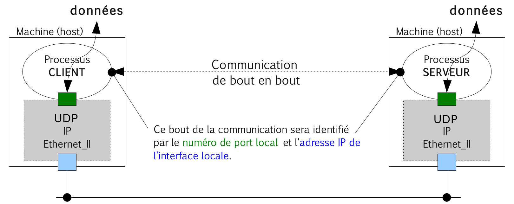
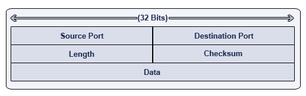

# Protocole UDP (_User Datagram Protocol_)

[UDP](https://fr.wikipedia.org/wiki/User_Datagram_Protocol) (_User Datagram Protocol_) est un protocole de transport qui Il assure lui aussi la transmission des données de bout en bout (d'un processus à un autre processus). Il est détaillé dans la [RFC 768](https://tools.ietf.org/html/rfc768).

> [UDP](https://fr.wikipedia.org/wiki/User_Datagram_Protocol) (_User Datagram Protocol_) est un protocole souvent décrit comme étant non-fiable, en mode non-connecté, mais plus rapide que [TCP](https://fr.wikipedia.org/wiki/Transmission_Control_Protocol).



## Caractéristiques

Avantage : UDP est un protocole **rapide** car

- simple (pas de connexion, pas d'états entre le client et le serveur)
- économique en bande passante (en-tête de 8 octets)
- sans contrôle de congestion donc UDP peut émettre sans attendre

Inconvénient : UDP est un protocole **non fiable** car

- pas d'acquittement donc pas de garantie de bon acheminement
- pas de détection de pertes donc pas retransmission possible
- pas de contrôle de flux et donc risque de saturation des _buffers_
- pas de séquencement donc les datagrammes peuvent être traités dans le désordre

## Utilisation

Pour les applications multimédias car :

- tolérance aux pertes
- sensible au débit
- _multicast_ possible
- Exemples : RTSP, RTP, RTCP, VoIP

Autres applications utilisant UDP car :

- faible volume de données
- pas besoin d'un service fiable
- Exemples : DNS, SNMP, BOOTP, DHCP

## Datagramme UDP



Détails : https://www.frameip.com/entete-udp/

## Taille d'un datagramme

Le champ _Length_ étant codé sur 16 bits, un datagramme aura une longueur totale maximale de 2^16 = 65535 octets (entête + data).

En pratique, on constate que :

- La plupart des systèmes limitent la taille des datagrammes à 8Ko (8192 octets).
- De nombreux protocoles de la couche Application utilisent un datagramme de 512 octets.

## Numéro de port

Le protocoles UDP (comme [TCP](https://fr.wikipedia.org/wiki/Transmission_Control_Protocol)) utilise les numéros de port comme technique d'adressage des bouts d'une communication.

Un numéro de port sert à identifier l'application (un processus) en cours de communication par l'intermédiaire de son protocole de couche application (associé au service utilisé, par exemple : `53` pour DNS).

Pour chaque port, un numéro lui est attribué (codé sur 16 bits), ce qui implique qu'il existe un maximum de 65 536 ports (2^16) par ordinateur (et par protocoles TCP et UDP).

L'attribution des ports est faite par le système d'exploitation, sur demande d'une application. Cette dernière peut demander à ce que le système d'exploitation lui attribue n'importe quel port, à condition qu'il ne soit pas déjà attribué.

Lorsqu'un processus client veut dialoguer avec un processus serveur, il a besoin de connaître le port écouté par ce dernier. Les ports utilisés par les services devant être connus par les clients, les principaux types de services utilisent des ports qui sont dits réservés.

Une [liste des ports attribués](https://www.iana.org/assignments/service-names-port-numbers/service-names-port-numbers.xhtml), par l'[IANA](https://fr.wikipedia.org/wiki/Internet_Assigned_Numbers_Authority) est disponible dans le fichier `/etc/services` sous Unix/GNU/Linux.

## Manipulations

- Démarre un serveur (`-l`) UDP (`-u`) multiclients (`-k`) sur le port `5000` :

```bash
$ nc -lk -u -p 5000
```

- Démarre un client UDP (`-u`) :

```bash
$ nc -u 192.168.1.1 5000
```

- Observe les sockets UDP sur le port `5000` :

```bash
$ netstat -nau | grep -E ":5000|Address"
Proto Recv-Q Send-Q Local Address   Foreign Address          State
udp        0      0 127.0.0.1:5000  127.0.0.1:49163          ESTABLISHED
udp        0      0 127.0.0.1:49163 127.0.0.1:5000           ESTABLISHED
```

- Scan de ports ouverts en UDP :

```bash
$ nmap -sU -p 5000-5005 192.168.1.1
```

Avec l’option `-sU` (UDP Scan), `nmap` envoie successivement des datagrammes vides sur la plage de port `5000` à `5005`. Il recevra des messages ICMP qui lui indiqueront que le numéro de port n’est pas "joignable" :

```
icmp.type = 3 (Destination unreachable)
icmp.code : 3 (Port unreachable)
```

S'il ne reçoit pas de message ICMP (_Port unreachable_) au bout d’un certain temps (_timeout_), il considérera le port ouvert.

> Lire : http ://nmap.org/man/fr/man-port-scanning-techniques.html

## Voir aussi

Protocole de transport :

- [TCP](tcp.md) : protocole de transport fiable en mode connecté

Boîtes à outils :

- [nmap](../../tldr/reseau/nmap.md) : outil d'exploration de réseau et scanneur de port
- [netstat](../../tldr/reseau/netstat.md) : affichage d'informations et statistiques réseau
- [netcat](../../tldr/reseau/netcat.md) : utilitaire permettant d'ouvrir des connexions réseau
- [iptables](../../tldr/reseau/iptables.md) : configuration des règles pare-feu
- [tcpdump](../../tldr/reseau/tcpdump.md) : capture et analyse le trafic réseau
- [Wireshark](../outils/../../outils/wireshark.md) : capture et analyse les trames

---
©️ LaSalle Avignon - [thierry(dot)vaira(at)gmail(dot)com](thierry.vaira@gmail.com)
