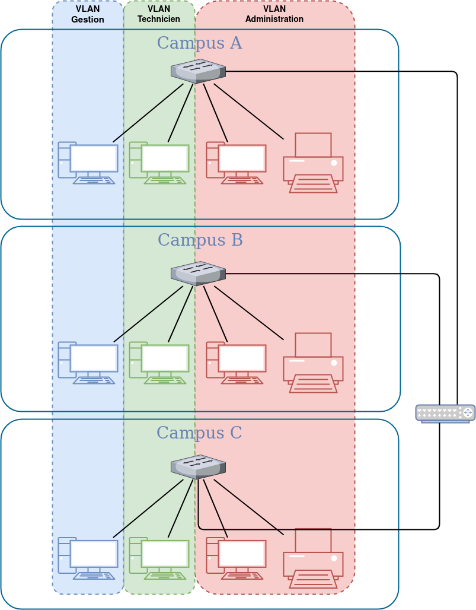
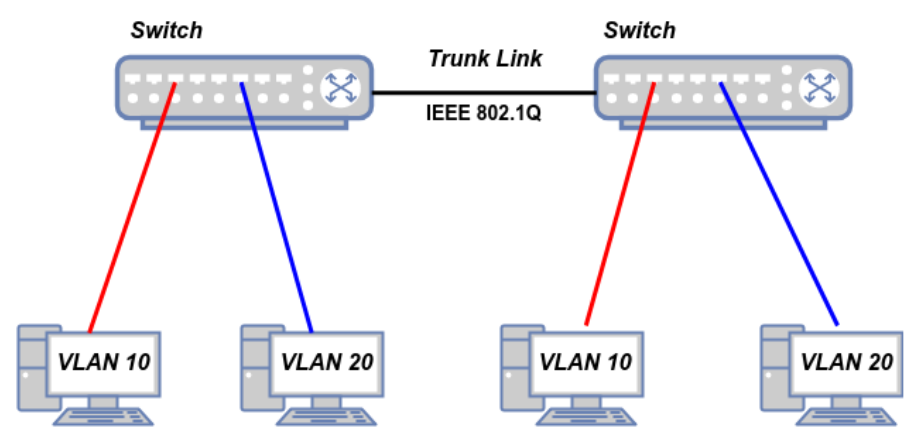
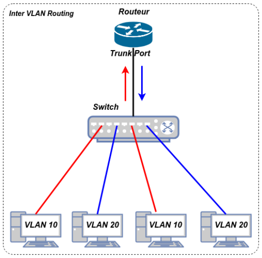
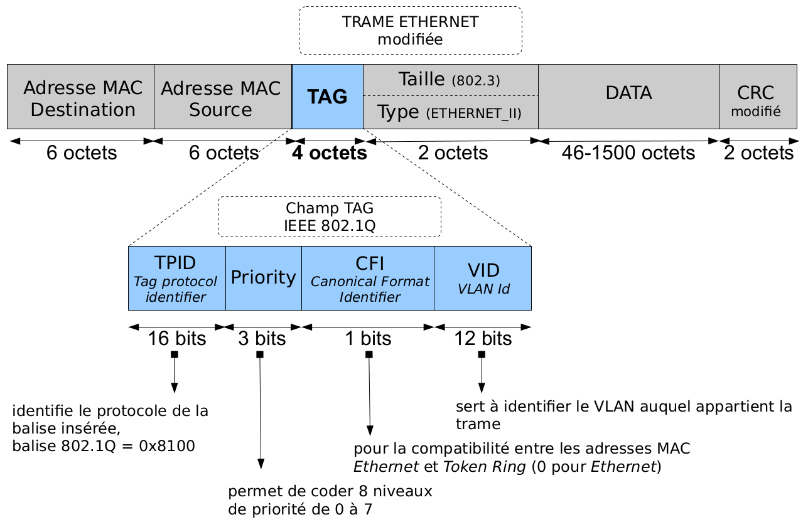
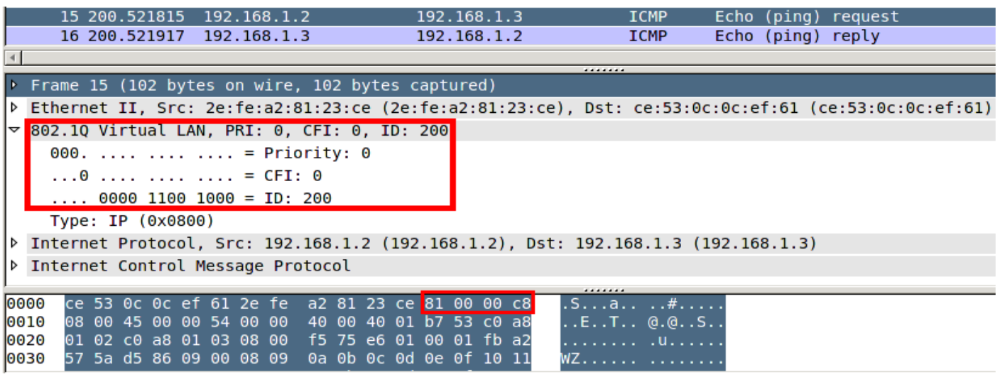

# VLAN (_Virtual LAN_)

Un [VLAN](https://fr.wikipedia.org/wiki/R%C3%A9seau_local_virtuel) ou **réseau local virtuel** est un réseau informatique logique indépendant.

En configurant un commutateur (_switch_), il est possible de créer des réseaux dits « virtuels » au sein d'un LAN (_Local Area Network_).

Plusieurs VLANs peuvent coexister sur un même commutateur réseau. Pour Ethernet, un VLAN est un domaine de diffusion (_broadcast domain_).

Les VLANs permettent la segmentation des réseaux ce qui permettra d'augmenter ou d'améliorer les performances (débit, bande passante, sécurité, ...).

> :bulb: Un **domaine de collision** est une zone logique d'un réseau informatique où les trames peuvent entrer en collision, ce qui est le cas des réseaux locaux Ethernet. Cela est lié à la topologie logique en bus et à la méthode d'accès CSMA/CD des réseaux Ethernet. Un concentrateur (hub) forme un seul domaine de collision alors qu'un commutateur (_switch_) en crée un par port, ce qui réduit les risques de collision. Lorsque Ethernet est utilisé en mode full-duplex, il  n'y a plus de domaine de collision, car aucune collision n'est possible.

> :bulb: Un **domaine de diffusion** (_broadcast domain_) est une aire logique d'un réseau informatique où n'importe quel hôte connecté au réseau peut directement transmettre à tous les autres hôtes du même domaine en envoyant une trame à l'adresse de diffusion.

## Construction des VLANs

### VLAN par port (_Port-based VLAN_)

On affecte chaque port du commutateur à un VLAN. En cas de déplacement d'une machine, il suffit d'affecter (manuellement) son VLAN au nouveau port.

### VLAN par adresse MAC (_MAC address-based VLAN_)

Chaque commutateur maintient une table @ MAC ←→ VLAN. Il faut les initialiser (solution : VLAN par défaut). Le commutateur détermine le VLAN de chaque trame à partir de l'adresse MAC source ou destination. Le déplacement d'une machine est possible et transparent.

### VLAN par adresse de niveau 3

On affecte une adresse de niveau 3 à un VLAN. L'appartenance d'une trame à un VLAN est alors déterminée par l'adresse de couche 3 (IP par exemple) qu'elle contient (le commutateur doit donc accéder à ces informations). Cela provoque un fonctionnement moins rapide que les VLANs par port ou par MAC. Quand on utilise le protocole IP on parle souvent de VLAN par sous-réseau.

## Le standard IEEE 802.1Q

Il permet de modifier la trame Ethernet au niveau de la sous-couche MAC (la couche 2 du modèle OSI) afin de fournir un mécanisme d'encapsulation très répandu et implanté dans de nombreux équipements de marques différentes. Il permet de propager plusieurs VLAN sur un même lien physique (_trunk_).

> :bulb: Le terme _trunk_ indique un lien de réseau supportant des VLAN multiples entre 2 commutateurs ou entre un commutateur et un routeur. Port _trunk_ : Port d’un commutateur qui transporte le trafic de plusieurs VLAN.

[802.1Q](https://fr.wikipedia.org/wiki/IEEE_802.1Q) définit le contenu de la balise de VLAN (_VLAN tag_) avec laquelle on complète l'en-tête de la trame Ethernet.

## Capture Wireshark

---
©️ LaSalle Avignon - [thierry(dot)vaira(at)gmail(dot)com](thierry.vaira@gmail.com)
