# GNS3

[GNS3](https://www.gns3.com/) (_Graphical Network Simulator_) est un logiciel libre permettant l’émulation ou la simulation de réseaux informatiques.

- Site officiel : <https://www.gns3.com/>
- Documentations : <https://docs.gns3.com/docs/>

- [GNS3](#gns3)
  - [Installation](#installation)
  - [GNS3 GUI](#gns3-gui)
    - [Les noeuds](#les-noeuds)
      - [VPCS](#vpcs)
      - [Conteneurs Docker](#conteneurs-docker)
      - [Machines virtuelles](#machines-virtuelles)
      - [Appareils (_appliance_)](#appareils-appliance)
        - [webterm](#webterm)
        - [Open vSwitch](#open-vswitch)
        - [Routeur Open source](#routeur-open-source)
    - [Configuration d’un noeud](#configuration-dun-noeud)
      - [Réseau](#réseau)
      - [Conteneur Docker](#conteneur-docker)
      - [Type de console](#type-de-console)
    - [Topologie d’une maquette](#topologie-dune-maquette)
    - [Capture de trames](#capture-de-trames)
    - [Divers](#divers)
    - [Web-Ui](#web-ui)
---

## Installation

Suivre la procédure donnée dans ce document : [installation-gns3.pdf](https://btssn-lasalle84.github.io/guide-reseaux/guides-pdf/installation-gns3.pdf)

Voir aussi : <https://docs.gns3.com/docs/getting-started/installation/linux/>

## GNS3 GUI

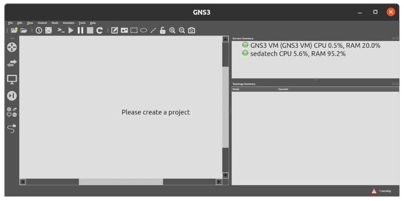

Exemple de maquette (_project_ dans GNS3) :

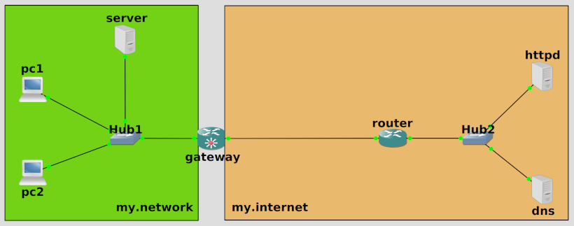

### Les noeuds

#### VPCS

VPCS (_Virtual PC Simulator_) est le simulateur fourni par défaut pour les noeuds. Ce programme, écrit par Paul Meng, permet de simuler un PC léger prenant en charge DHCP et ping. Il ne consomme que 2 Mo de RAM par instance et ne nécessite pas d’image supplémentaire.

Documentation : <https://docs.gns3.com/docs/emulators/vpcs/>

#### Conteneurs Docker

Il est possible d’utiliser des conteneurs [Docker](https://fr.wikipedia.org/wiki/Docker_(logiciel)) pour les noeuds dans GNS3 (<https://docs.gns3.com/docs/emulators/docker-support-in-gns3>).

> Des conteneurs Docker pour GNS3 sont disponibles ici :
> - <https://hub.docker.com/u/gns3/>
> - <https://hub.docker.com/r/tvaira/>

Dans nos maquettes, on utilisera :

- pour les machines hôtes, on utilisera `tvaira/ubuntu-2004-gns3:latest`
- pour les machines clientes GUI, on utilisera `tvaira/clients-debian-gns3:latest`
- pour les machines serveurs, on utilisera `tvaira/server-ubuntu2004-gns3:latest`
- pour les routeurs, on utilisera `kathara/quagga:latest`

> L’image `tvaira/clients-debian-gns3:latest` fournit **Firefox** et **Filezilla** et nécessite `vncviewer` pour s’y connecter à partir d’une console :
>
>     $ wget https://www.realvnc.com/download/file/viewer.files/VNC-Viewer-6.21.1109-Linux-x64.deb
>     $ sudo dpkg -i VNC-Viewer-6.21.1109-Linux-x64.deb

Pour ajouter une nouveau conteneur Docker, aller dans `Edit` → `Preferences` → `Docker containers` et cliquer sur `New` :

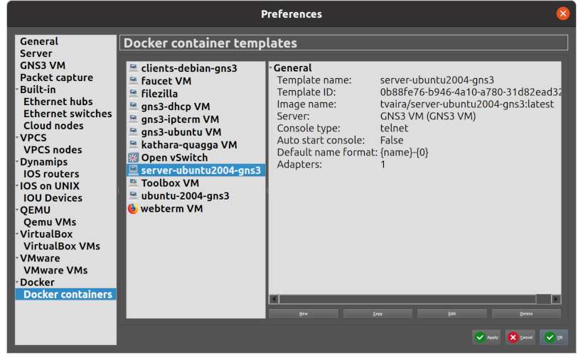

Puis :

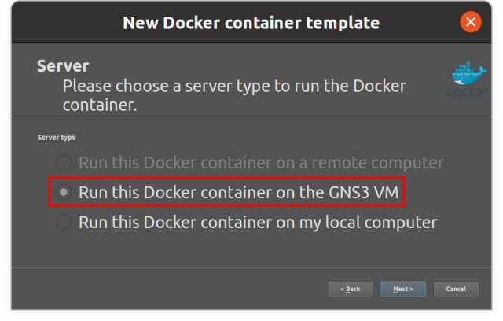

Choisir entre une image existante :

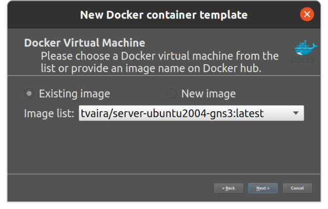

ou nouvelle image (<https://hub.docker.com/>) :

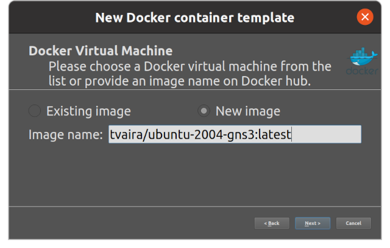

Terminer en donnant un nom :

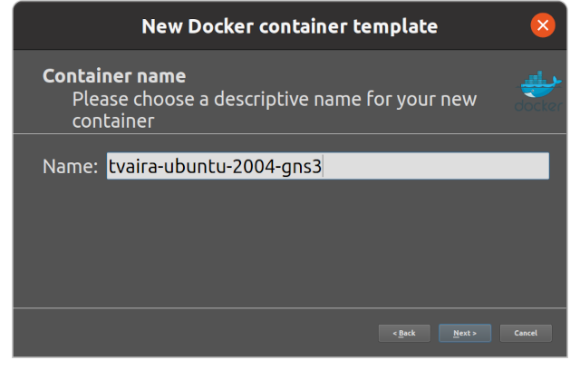

#### Machines virtuelles

Il est possible d’utiliser des VM de VirtualBox ou VMWare.

Pour ajouter une VM de VirtualBox, aller dans `Edit` → `Preferences` → `VirtualBox VMs` et cliquer sur `New` :

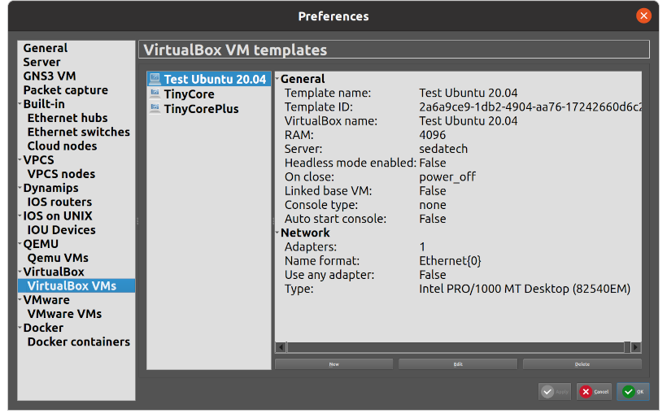

Choisir une VM dans la liste :

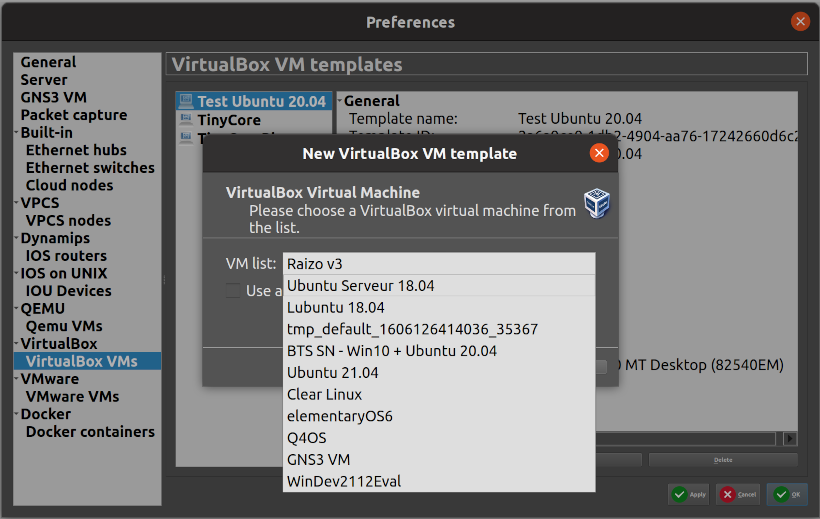

Terminer en cliquant sur `Finish` :

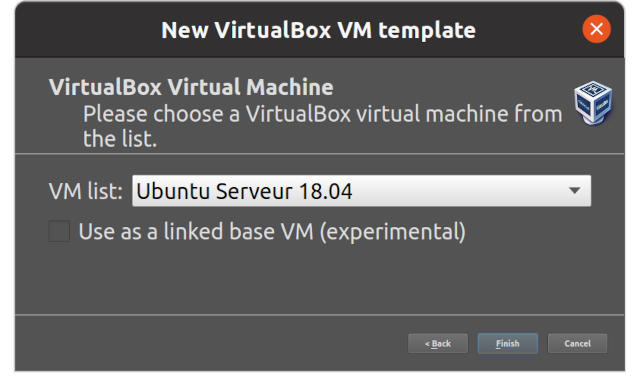

Intégration de Kali linux dans une maquette GNS :

#### Appareils (_appliance_)

Les _appliances_ sont disponibles au téléchargement sur le _marketplace_ de GNS3 : <https://gns3.com/marketplace/appliances/>

Voir aussi : <https://github.com/GNS3/gns3-registry/tree/master/appliances>

> Certains appareils nécessitent `vncviewer` pour s’y connecter à partir d’une console :
>
>     $ wget https://www.realvnc.com/download/file/viewer.files/VNC-Viewer-6.21.1109-Linux-x64.deb
>     $ sudo dpkg -i VNC-Viewer-6.21.1109-Linux-x64.deb

##### webterm

**webterm** est une boîte à outils réseau basée sur Debian. Il contient le navigateur web Firefox et les utilitaires suivants : `net-tools`, `iproute2`, `ping`, `traceroute`, `curl`, `host`, `iperf3`, `mtr`, `socat`, `ssh`, `tcpdump`, ...

Télécharger l'_appliance_ sur le _marketplace_ de GNS3 : <https://gns3.com/marketplace/featured/webterm>

> L’image `tvaira/clients-debian-gns3:latest`, basée sur *webterm*, ajoute **Filezilla**.

##### Open vSwitch

**Open vSwitch** est un commutateur virtuel multicouche.

Documentation : <http://openvswitch.org/support/>

Télécharger l'*appliance* sur le *marketplace* de GNS3 : <https://gns3.com/marketplace/appliances/open-vswitch>

Open vSwitch supportant le protocole OpenFlow, il est possible d’ajouter une administration à distance des commutateurs via un contrôleur **Faucet**.

> **Note**
>
> OpenFlow est un protocole réseau standard qui permet de réaliser une architecture Software-defined networking (SDN). Ce protocole est constitué d’instructions qui permet de programmer le plan de contrôle d’un équipement réseau.

Les contrôleurs comme Faucet utilisent OpenFlow pour contrôler la façon dont Open vSwitch (et d’autres commutateurs) traitent les trames et les paquets dans le réseau.

On ajoute un conteneur Docker avec l’image `faucet/faucet:latest` :

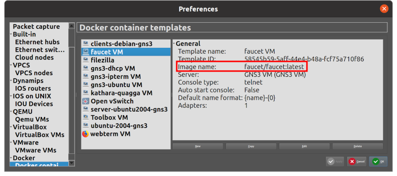

Puis on ajoute la commande à exécuter au démarrage :

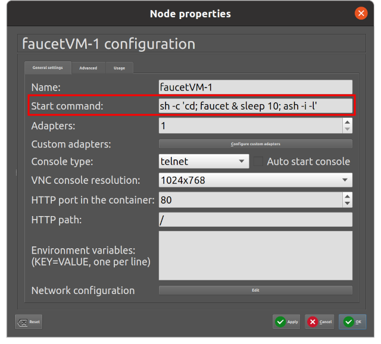

##### Routeur Open source

**pfSense** est un projet de routeur open source basé sur FreeBSD (une version de linux) prenant en charge le routage, le DHCP et le NAT. De plus, il possède un *firewall*.

Liens :

- <https://www.pfsense.org/about-pfsense/features.html>
- <https://doc.pfsense.org/index.php/Main_Page>

Télécharger l'*appliance* : <https://gns3.com/marketplace/featured/pfsense>

Puis l’installer dans GNS3 :

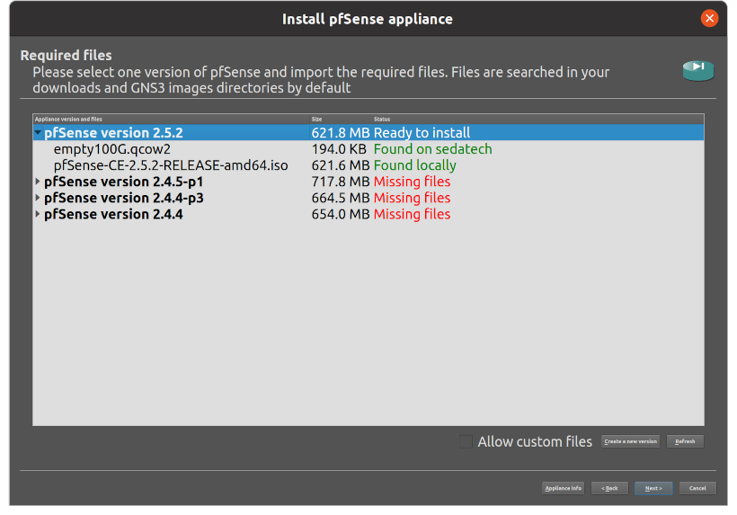

### Configuration d’un noeud

#### Réseau

Il est habituel d’éditer la configuration réseau d’un noeud :

Puis par exemple pour l’interface `eth0` :

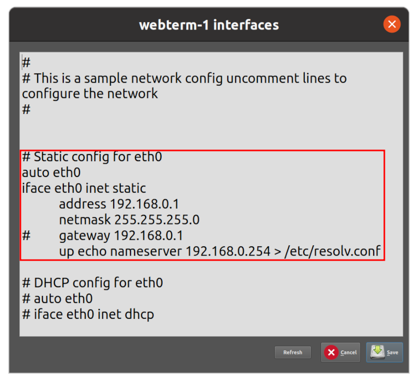

> Le mot clé `up` permet d’ajouter des commandes au démarrage de l’interface, par exemple : `up route add -net 172.16.32.0 netmask 255.255.255.0 gw 192.168.0.254`

#### Conteneur Docker

Pour les conteneurs Docker, on configure généralement :

- la commande à exécuter au démarrage (*start command*), par exemple : `sh -c "/bin/bash -i"` ou tout simplement `/bin/bash"`
- le nombre d’interface réseau (*adapters*), 1 par défaut
- le type de console (`telnet`, `vnc` ou `http`)
- les variables d’environnement, par exemple : `PROMPT_COMMAND=history -a` (pour conserver l’historique des commandes saisies)

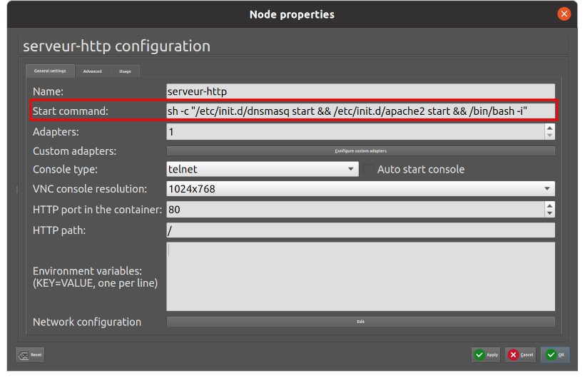

Dans l’onglet `Advanced` :

- ajouter des noms d’hôte dans le fichier `/etc/hosts`
- ajouter des répertoires persistants au conteneur Docker, par exemple :

#### Type de console

On utilise habituellement une console de type `telnet` pour opérer avec un noeud. Si le noeud fournit une GUI, il faudra utiliser `vncviewer` pour s’y connecter à partir d’une console :

    $ wget https://www.realvnc.com/download/file/viewer.files/VNC-Viewer-6.21.1109-Linux-x64.deb
    $ sudo dpkg -i VNC-Viewer-6.21.1109-Linux-x64.deb

Certains conteneurs utilise `http` :

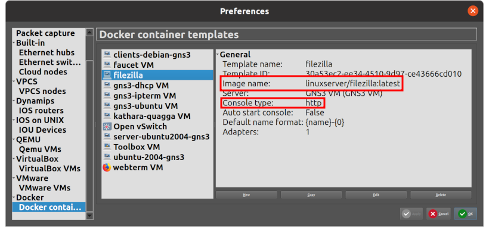

### Topologie d’une maquette

Créer un nouveau projet ou télécharger et importer dans GNS3 une maquette fournie pour un TP :

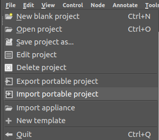

Exemple de maquette basique :

Il faut démarrer les machines de la maquette (toutes avec la flèche verte de la barre d’outils ou individuellement avec le menu contextuel clic droit d’une machine):

L’ensemble des noeuds en action :

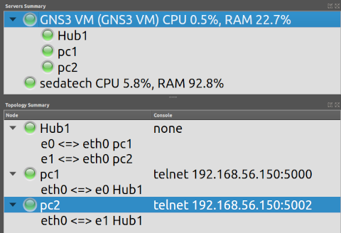

### Capture de trames

Il est possible de démarrer une (ou plusieurs) capture **Wireshark** sur un lien de la maquette :

ou :

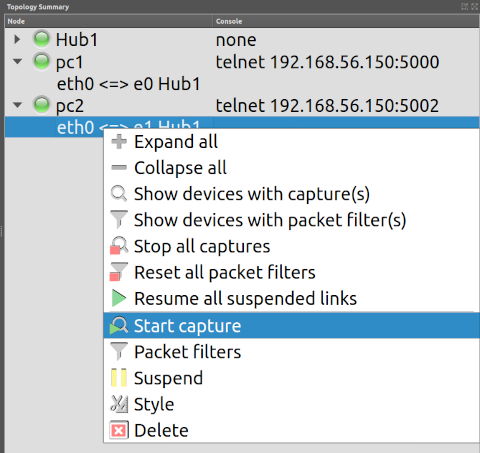

Puis :

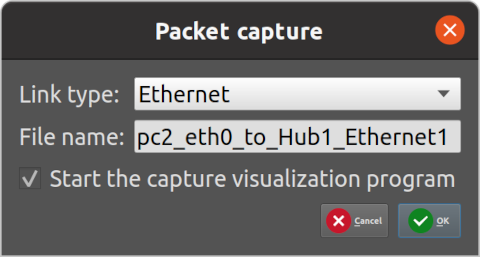

### Divers

Au démarrage d’une machine, il est possible que les liens symboliques (déterminant les noms par défaut de certaines commandes par exemple) soient manquants. Une méthode simple pour corriger les alternatives cassées est d’utiliser :

    # yes '0' | update-alternatives --force --all

### Web-Ui

L’accès à GNS3 peut aussi se faire par une interface Web : `http://<adresse-ip>/`

> Utiliser l’adresse IP de l’interface réseau avec un Accès par pont.

---
©️ LaSalle Avignon - [thierry(dot)vaira(at)gmail(dot)com](thierry.vaira@gmail.com)
