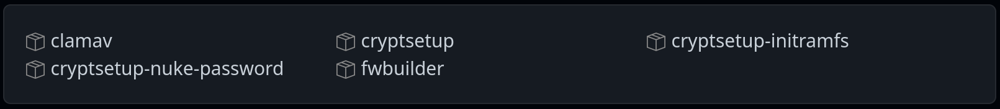

# Outils Hacking

Les outils utilisés dans la Cybersécurité sont très très nombreux ...

Une bonne base : https://www.kali.org/tools/

- [Outils Hacking](#outils-hacking)
  - [TOP 10](#top-10)
  - [Collecte d'informations](#collecte-dinformations)
  - [Mots de passe](#mots-de-passe)
  - [Vulnérabilités](#vulnérabilités)
  - [Exploitation](#exploitation)
  - [Rétro-ingénierie (_reverse engineering_)](#rétro-ingénierie-reverse-engineering)
  - [Capture et analyse (_sniffing_)](#capture-et-analyse-sniffing)
  - [Protection](#protection)
  - [Récupération](#récupération)
  - [Web](#web)
  - [Autres](#autres)
    - [Signalements et alertes](#signalements-et-alertes)
    - [Renseignement d'origine sources ouvertes (OSINT)](#renseignement-dorigine-sources-ouvertes-osint)
    - [Reconnaissance passive](#reconnaissance-passive)
    - [Moteurs de recherche](#moteurs-de-recherche)

## TOP 10

## Collecte d'informations

## Mots de passe

## Vulnérabilités

> **OpenVAS** a été renommé GVM (Greenbone Vulnerability Manager).

Voir aussi : [Nessus](https://www.tenable.com/downloads/nessus?loginAttempted=true)

## Exploitation

Voir aussi :

## Rétro-ingénierie (_reverse engineering_)

## Capture et analyse (_sniffing_)

## Protection

## Récupération

## Web

## Autres

### Signalements et alertes

Lien : https://www.cert.ssi.gouv.fr/

### Renseignement d'origine sources ouvertes (OSINT)

Lien : https://osintfr.com/fr/outils/

### Reconnaissance passive

- Google dorks : https://www.boxpiper.com/posts/google-dork-list
- Exploit Database : https://www.exploit-db.com/

### Moteurs de recherche

- [Shodan](https://fr.wikipedia.org/wiki/Shodan_(site_web)) est un moteur de recherche qui référence le résultat de balayages de ports massifs effectués sur le réseau Internet. Lien : https://www.shodan.io/

- [Vulmon](https://vulmon.com/) est un moteur de recherche de vulnérabilités.

Exemples:

  - Recherche les vulnérabilités d'Apache Tomcat :
    `https://vulmon.com/searchpage?q=apache+tomcat&sortby=bydate`
  - Recherche les vulnérabilités d'Apache Tomcat 8.5.10 :
    `https://vulmon.com/searchpage?q=Apache+Tomcat+8.5.10&sortby=bydate`
  - Recherche les vulnérabilités d'Injection SQL :
    `https://vulmon.com/searchpage?q=sql+injection&sortby=bydate`

---
©️ LaSalle Avignon - [thierry(dot)vaira(at)gmail(dot)com](thierry.vaira@gmail.com)
