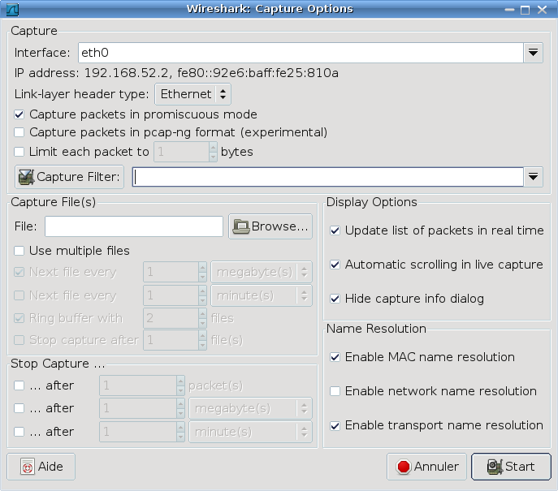

# Wireshark

[Wireshark](https://www.wireshark.org/) est un analyseur de trames libre et gratuit. Il est utilisé dans le dépannage et l’analyse de réseaux informatiques, le développement de protocoles, l’éducation et la rétro-ingénierie.

## Capture

Cliquer sur « _Interface List_ » pour visualiser les interfaces réseaux disponibles pour une capture :

> Il est possible aussi de charger un fichier de capture de trames.

Il existe des options intéressantes avant de démarrer une capture :

- _Update list of packets in real time_ : affiche en temps réel à l’écran les trames capturées.
- _Enable MAC name resolution_ : affiche le nom de la machine ou son adresse IP à la place de l’adresse MAC.
- _Enable network name resolution_ : affiche le nom d’hôte de la machine à la place de l’adresse IP.
- _Enable transport name resolution_ : remplace les numéros de port TCP et UDP par le nom du protocole applicatif associé.

Il est évidemment possible de créer des filtres de capture (qui n’enregistrent que les trames conformes à la règle) et d'enregistrer une capture dans un fichier. Il y a aussi des options pour afficher une capture en temps réel.

> On laissera généralement l'activation du **mode _promiscuous_** qui permet à une carte réseau d'accepter tous les paquets qu'elle reçoit, même si ceux qui ne lui sont pas adressés. Ce mode est une fonctionnalité utilisée pour écouter (_sniffer_) tout le trafic réseau.

## Affichage

L'affichage se décompose en trois cadres :

- cadre 1 : les trames capturées (la capture en temps réel est possible)
- cadre 2 : contenu décodé des protocoles encapsulés, couche par couche, de la trame sélectionnée dans le cadre 1
- cadre 3 : « _dump_ » en hexadécimal de la trame sélectionnée dans le cadre 1 et mis en surbrillance pour le protocole sélectionné dans le cadre 2

> Un « dump » est un affichage à trois colonnes utilisée à l'origine pour visualiser un contenu mémoire : la colonne 1 indique la **position** (ou l'_offset_) du premier octet de la ligne, la colonne 2 le **contenu en hexadécimal** et la colonne 3 la **représentation ASCII** de chaque octet. Chaque ligne représente 16 octets.

## Filtrage

Il est fréquent de créer des filtres d'affichage qui ne montrent que les trames conformes à la règle de filtrage. Cela permettra d'isoler un échange en particulier ou l'analyse d'un protocole spécifique.

On renseignera alors le cadre _Filter_ dans la barre du haut du cadre 1 :

Le bouton « Expression » permet d'accéder à un assistant pour créer une règle de filtrage. Une règle de filtrage s'appuie sur les champs des en­têtes (_header_) des protocoles connus du logiciel Wireshark :

En cliquant sur « Valider » puis sur « _Apply_ », on obtient alors un affichage filtré :

On peut créer des règles de filtrage en combinant plusieurs expressions avec des opérateurs `&&` (ET), `||` (OU) et `!` (INVERSEUR), par exemple :

- Toutes les trames dont l'adresse IP destination est égale à `145.254.160.237` et dont le port source ou destination n'est pas `80` : `ip.dst == 145.254.160.237 && !tcp.port == 80`

> En entrant directement dans la zone de saisie « Filter », Wireshark propose une complétion bien pratique.

Wireshark est capable de décoder les champs des différents en­tête de protocoles présents dans la trame capturée.

> :warning: Sans connaissances théoriques, l'utilisation de Wireshark s'avère très vite limitée ! C'est un outil de spécialiste. En effet, qu'est-­ce qu'une « _address unicast_ » ? « _Seq_ » ? etc ... C'est l'exploitation des ces différentes informations qui font l'expertise d'un technicien réseau.

## Encapsulation

Le cadre 2 illustre le principe de l'encapsulation des protocoles utilisé dans l'échange d'une trame. On fait souvent référence à un modèle pour représenter cette communication. Ici, le modèle est celui qui implémente les protocoles de la famille « TCP/IP » appelée aussi [DoD](https://www.frameip.com/tcpip/) (_Department of Defense_).

En sachant qu'une couche se décomposera en deux parties comprenant un en­tête (_header_) appelé aussi PCI (_Protocol Control Information_) dans le modèle [OSI](https://www.frameip.com/osi/) et un champ _payload_ ou DATA (au sens « _network data_ ») ou PDU (_Protocol Data Unit_) dans le modèle [OSI](https://www.frameip.com/osi/). En fait, cela représente les protocoles présents dans la trame de la manière suivante :

On comprend alors que le champ DATA d'une couche contient le bloc de la couche supérieure (Header + DATA) et ainsi de suite. C'est le principe de l'**encapsulation** des protocoles.

Une fois le rapprochement fait avec le modèle « TCP/IP », on obtient la « vision suivante » :

> Certaines couches ou certains champs DATA peuvent être vides. Par exemple, une demande de connexion TCP vers un site web n'encapsule que les protocoles Ethernet_II, IP et TCP car la couche application est pour l'instant vide.

Il y a deux aspects à prendre en compte dans un échange :

- le transfert physique de trames contenant des protocoles encapsulés (fabrication à l'émission et décodage à la réception : parcours vertical du modèle). Sur un réseau physique, la trame est la seule composante concrètement échangée par des noeuds.
- un dialogue logique entre protocole de couche spécifique (dialogue virtuel horizontal entre deux modèles). C'est un même protocole qui permet à deux entités de "se comprendre".

Comme il peut exister plusieurs protocoles par couche, un protocole utilise des numéros (les _assigned numbers_) identifiant les protocoles de niveau supérieur qu’il transporte.

> La trame Ethernet_II possède un champ `Type` (`/etc/ethertypes`) qui indique le type de paquet transporté. Un paquet IP possède un champ `Protocol` (`/etc/protocols`) qui indique le protocole de couche supérieure. Un segement TCP ou un datagramme UDP possède un champ `Port Destination` (`/etc/services`) qui indique le protocole de couche Application. Ces différentes valeurs ont été renseignées lors de l'émission et permettent de "remonter" le modèle à couches à la reception.

Voir aussi :

## Statistiques

Wireshark fournit aussi des outils pour l’analyse et les statistiques du trafic capturé.

- _Summary_ : statistiques générales sur la capture actuelle
- _Protocol Hierarchy_ : statistiques sur la pile de protocoles utilisé dans l'échange
- _Conversations_ : statistiques des conversations saisies. Une conversation est le trafic entre deux points de terminaison spécifique. Par exemple, une conversation IP est tout le trafic entre deux adresses IP.
- _Endpoints_ : statistiques des points de terminaison. Un point de terminaison réseau est la terminaison logique d'un protocole d'une couche spécifique.

## Voir aussi

- [tcpdump](../tldr/reseau/tcpdump.md)

---
©️ LaSalle Avignon - [thierry(dot)vaira(at)gmail(dot)com](thierry.vaira@gmail.com)
