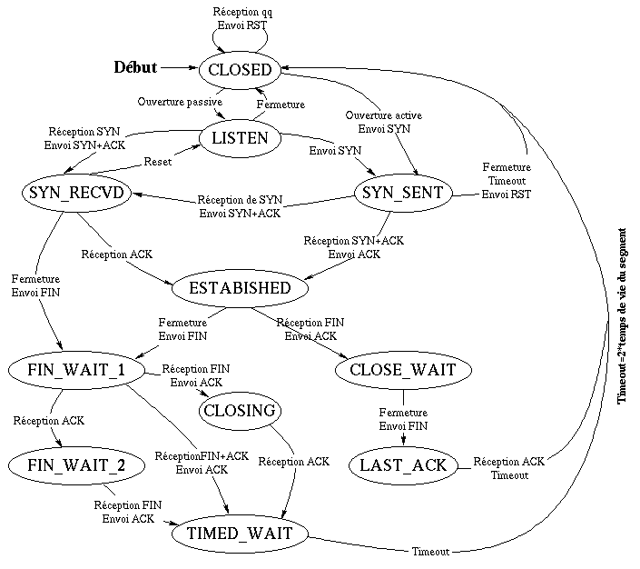

# tldr netstat

La commande `netstat` (_network statistics_) est une commande en ligne affichant des informations sur les connexions réseau, les tables de routage et un certain nombre de statistiques. La commande est disponible sous Unix/Linux et sous Windows.

```bash
$ tldr netstat

  netstat

  Displays network-related information such as open connections, open socket ports, etc.
  More information: https://man7.org/linux/man-pages/man8/netstat.8.html.

  - List all ports:
    netstat --all

  - List all listening ports:
    netstat --listening

  - List listening TCP ports:
    netstat --tcp

  - Display PID and program names:
    netstat --program

  - List information continuously:
    netstat --continuous

  - List routes and do not resolve IP addresses to hostnames:
    netstat --route --numeric

  - List listening TCP and UDP ports (+ user and process if you're root):
    netstat --listening --program --numeric --tcp --udp --extend
```

- Statistiques sur les interfaces :

```bash
$ netstat -i
Table d'interfaces noyau
Iface MTU  Met RX-OK RX-ERR RX-DRP RX-OVR TX-OK TX-ERR TX-DRP TX-OVR Flg
eth1  1500   0 14759173   0      0      0 17579724  0      0      0 BMRU
lo    16436  0   827750   0      0      0   827750  0      0      0 LRU
```

- Statistiques par protocole :

Par défaut, les statistiques sont affichées pour IP, IPv6, ICMP, ICMPv6, TCP, TCPv6, UDP et UDPv6.

```bash
$ netstat -s | less
$ netstat -s
Ip:
    2302343 total packets received
    0 forwarded
    0 incoming packets discarded
    2302277 incoming packets delivered
    2151721 requests sent out
    47 outgoing packets dropped
    42 reassemblies required
    21 packets reassembled ok
    1599 fragments received ok
    47 fragments failed
    3198 fragments created
Icmp:
    5534 ICMP messages received
...
IcmpMsg:
        InType0: 6
        InType3: 5500
        InType8: 7
        InType11: 21
        OutType0: 7
        OutType3: 12678
        OutType8: 23
Tcp:
    34098 active connections openings
...
Udp:
    124518 packets received
    8626 packets to unknown port received.
    5 packet receive errors
    127800 packets sent
...
UdpLite:
TcpExt:
    1622 invalid SYN cookies received
...
IpExt:
    InMcastPkts: 6724
...
```

On peut choisir son protocole : [--tcp|-t] [--udp|-u] [--raw|-w] [--inet|--ip] etc ...

```bash
$ netstat -t -s | less
$ netstat -u -s | less
$ netstat -w -s | less
$ netstat --ip -s
```

- Statistiques sur les sockets actives et passives :

Le paramètre -a affiche toutes les sockets, y compris les sockets d'écoute  des serveurs. On peut spécifier un protocole : [--tcp|-t] [--udp|-u] etc ...

```bash
$ netstat -ta
Connexions Internet actives (serveurs et établies)
Proto Recv-Q Send-Q Local Address    Foreign Address         State
tcp        0      0 *:sunrpc         *:*                     LISTEN
...
tcp        0      0 127.0.0.1:57246  127.0.0.1:5000          ESTABLISHED
```

> On peut désactiver la résolution de noms avec l'option -n

Pour UDP :

```bash
$ netstat -ua
Connexions Internet actives (serveurs et établies)
Proto Recv-Q Send-Q Local Address   Foreign Address          State
udp        0      0 *:sunrpc        *:*
...
udp        0      0 0.0.0.0:5000    0.0.0.0:*
```

La colonne _State_ donne l'état de la socket. Puisqu'il n'y a pas d'état dans le mode RAW et généralement pas d'état utilisé en UDP, cette colonne peut rester vierge. Cette colonne est particulièrement intéressante en TCP.

Normalement, on trouvera une des valeur suivante :

- ESTABLISHED : La socket a une connexion établie.
- SYN_SENT : La socket attend activement d'établir une connexion.
- SYN_RECV : Une requête de connexion a été reçue du réseau.
- FIN_WAIT1 : La socket est fermée, et la connexion est en cours de terminaison.
- FIN_WAIT2 : La connexion est fermée, et la socket attend une terminaison du distant.
- TIME_WAIT : La socket attend le traitement de tous les paquets encore sur le réseau avant d'entreprendre la fermeture.
- CLOSED : La socket n'est pas utilisée.
- CLOSE_WAIT : Le distant a arrêté, attendant la fermeture de la socket.
- LAST_ACK : Le distant termine, et la socket est fermée. Attente d'acquittement.
- LISTEN : La socket est à l'écoute de connexions entrantes. Ces sockets ne sont affichées que si le paramètre -a,--listening est fourni.
- CLOSING : Les deux prises sont arrêtées mais toutes les données locales n'ont pas encore été envoyées.
- UNKNOWN : L'état de la prise est inconnu.

En TCP, les états d'une socket proviennent des 6 bits du champ Flag de l'entête TCP :

- URG (_Urgent Pointer_) : contient des données urgentes
- ACK (_Acknowledge Field_) : acquittement
- PSH (_Push Flag_) : passer immédiatement les données à la couche application
- RST (_Reset Flag_) : forcer la clôture d'une connexion après une erreur irrécupérable.
- SYN (_Synchronize Flag_) : synchroniser le démarrage d'une connexion
- FIN : pour terminer une connexion

Une socket est toujours créée dans un état fermé (CLOSED). Puis elle passera soit en « ouverture passive » pour un serveur (état LISTEN ou en écoute de demande connexion) soit en « ouverture active » pour un client qui initie une demande de synchronisation de numéro de séquence (envoi SYN) que l'on nomme aussi « demande de connexion ».

Ce qui donne le schéma suivant pour les différents états d'une socket :



> Il est normal d'avoir des sockets dans l'état TIME_WAIT pour une longue période de temps. Le temps est spécifiée dans la RFC793 comme deux fois le maximum segment life (MSL) time. Le MSL de Microsoft est défini comme étant de 2 minutes. Par conséquent, une socket peut être dans un état TIME_WAIT aussi longtemps que 4 minutes. Certains systèmes mettent en oeuvre des valeurs différentes. Sous Unix, la valeur recommandée est aussi de 2 minutes (120 s).

Voici quelques commandes qui permettent d'exploiter les statistiques fournies par `netstat` afin de surveiller l'activité réseau d'une machine ...

Compter les états des sockets passives et actives

```bash
$ netstat -nat | awk '{print $6}' | sort | uniq -c | sort -n
      1 CLOSE_WAIT
      1 établies)
      1 FIN_WAIT1
      1 Foreign
      1 SYN_SENT
     11 LISTEN
     12 TIME_WAIT
     56 ESTABLISHED
```

Compter les états des sockets pour une adresse IP en particulier :

```bash
$ netstat -nat |grep {IP-address} | awk '{print $6}' | sort | uniq -c | sort -n
```

Afficher la liste des adresses IP connectés :

```bash
$ netstat -nat | sed 1d | sed 1d | awk '{ print $5}' | cut -d: -f1 | sed -e '/^$/d' | uniq
```

Afficher le nombre d'adresses IP connectés :

```bash
$ netstat -nat | sed 1d | sed 1d | awk '{ print $5}' | cut -d: -f1 | sed -e '/^$/d' | uniq | wc -l
```

Compter le nombre de sockets connectés par adresse IP :

```bash
$ netstat -atun | sed 1d | sed 1d | awk '{print $5}' | cut -d: -f1 | sed -e '/^$/d' |sort | uniq -c | sort -n

$ netstat -atun | awk '{print $5}' | sed -n -e '/[0-9]\{1,3\}\.[0-9]\{1,3\}\.[0-9]\{1,3\}\.[0-9]\{1,3\}/p' | sed 's/::ffff://' | cut -d: -f1 | sort | uniq -c | sort -n
```

Compter le nombre de sockets dans l'état ESTABLISHED par adresse IP :

```bash
$ netstat -atun | grep ESTABLISHED | awk '{print $5}' | cut -d: -f1 | sed -e '/^$/d' |sort | uniq -c | sort -n
```

## Voir aussi

```bash
$ tldr ss

  ss

  Utility to investigate sockets.
  More information: https://manned.org/ss.8.

  - Show all TCP/UDP/RAW/UNIX sockets:
    ss -a -t|-u|-w|-x

  - Filter TCP sockets by states, only/exclude:
    ss state/exclude bucket/big/connected/synchronized/...

  - Show all TCP sockets connected to the local HTTPS port (443):
    ss -t src :443

  - Show all TCP sockets listening on the local 8080 port:
    ss -lt src :8080

  - Show all TCP sockets along with processes connected to a remote ssh port:
    ss -pt dst :ssh

  - Show all UDP sockets connected on specific source and destination ports:
    ss -u 'sport == :source_port and dport == :destination_port'

  - Show all TCP IPv4 sockets locally connected on the subnet 192.168.0.0/16:
    ss -4t src 192.168/16

  - Kill IPv4 or IPv6 Socket Connection with destination IP 192.168.1.17 and destination port 8080:
    ss --kill dst 192.168.1.17 dport = 8080
```

---
©️ LaSalle Avignon - [thierry(dot)vaira(at)gmail(dot)com](thierry.vaira@gmail.com)
